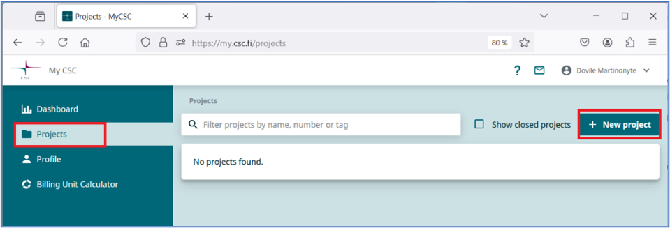
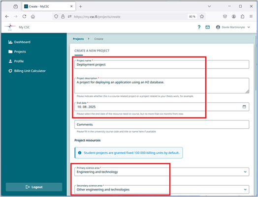
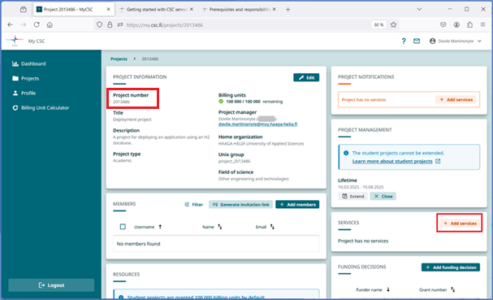
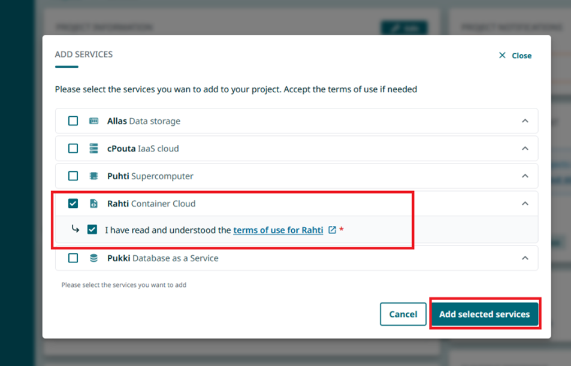
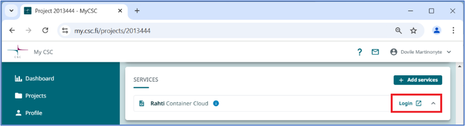
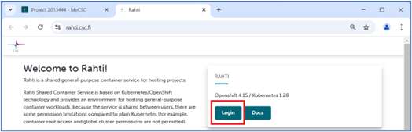
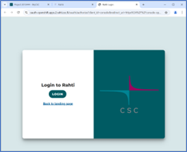
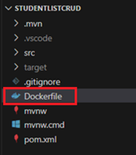
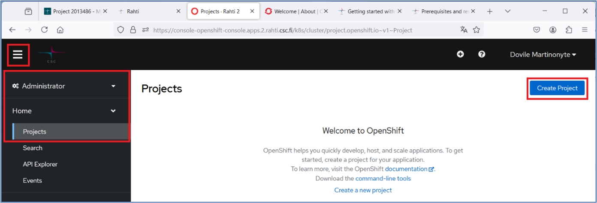
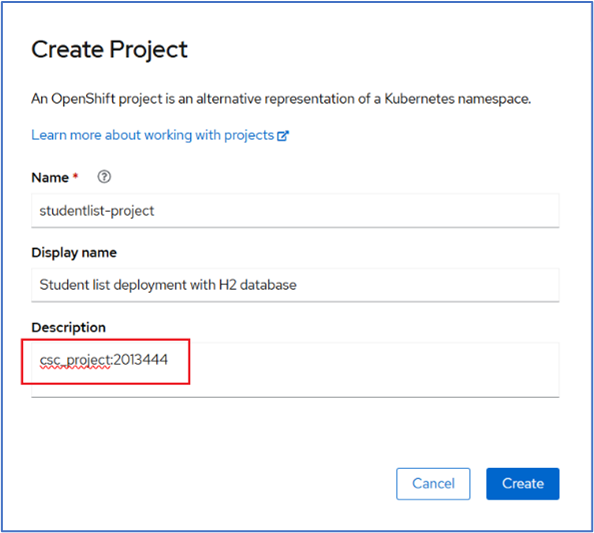

# 1 Create a new project in MyCSC portal

1. Log in to the CSC environment, <https://my.csc.fi/>.
2. Navigate to the **`Projects`** tab in MyCSC portal management view and click **`+ New Project`**.



3. Enter the required project details:
  * **`Project name`** and **description**
  * **`Course end date`**: can be at most six months from the creation date.
  * **`Project resources`**:
    + Primary science area: **Engineering and technology**
    + Secondary science area: **Other engineering and technologies**

- Review the Terms of Use and READ CAREFULLY [documentation about CSC services for students](https://docs.csc.fi/support/tutorials/student_quick/)
Click the **`Create Project`** button.

\* A course project is single-use. It cannot be extended, copied, or allocated additional resources. The default resource allocation for the project is 100 000 BU (billing units).

\* The project and all its resources will be automatically deleted after the end date.

**Note: Personal data must not be stored in course project services.**



4. Add services to your project. In this course, you will need the Rahti service from CSC’s offerings. You will also need the **`project number`** later for the actual application deployment.



5. Click on the **`+ Add services`** button. A new view with services listed will appear. Select **`Rahti`**, accept the terms of use for the Rahti and click **`Add selected services`** button.



6. In the **`Services`** card, you will now see **`Rahti Container Cloud`** service. Log in to the Rahti service by clicking the **`Login`** button.



A new tab <https://rahti.csc.fi/> will open in your browser. Click the **`Login`** button.



Click **`Login`** and sign in using your **`CSC`** or **`Haka credentials`**.

||-->||
|-|-|-|

**Note**: if you have registered to my.csc.fi just before following these instructions, it may take some time for your account to activate, so you might see an error message: “Could not find user”. Try going back to the Rahti service login step after a while.


Once your login is successful, you can get started with a tour to improve your workflow or skip it.

# 2 Deploy a Spring Boot Application with an H2 database on Rahti

## 2.1 Prepare your Spring Boot Application

1. Create a new file in the **`root`** directory of your Spring Boot application and name it **`Dockerfile`** (without a file extension).

2. Copy the following content into the **`Dockerfile`** (this can also be found in the course’s Moodle page):
```
FROM eclipse-temurin:17-jdk-focal as builder
WORKDIR /opt/app
COPY .mvn/ .mvn
COPY mvnw pom.xml ./
RUN chmod +x ./mvnw
RUN ./mvnw dependency:go-offline
COPY ./src ./src
RUN ./mvnw clean install -DskipTests
RUN find ./target -type f -name '\*.jar' -exec cp {} /opt/app/app.jar \; -quit
FROM eclipse-temurin:17-jre-alpine
COPY --from=builder /opt/app/\*.jar /opt/app/
EXPOSE 8080
ENTRYPOINT ["java", "-jar", "/opt/app/app.jar"]
```

3. Push your updated application to GitHub.

**Note:** These instructions assume your GitHub repository is **public.** *(If needed, you can make it public temporarily during deployment and switch it back to private later.)*

Private repositories can also be used, but this document does not cover that method.

## 2.2 Spring Boot application deployment

1. Navigate to the top left menu. Choose your role **`Administrator`** 🡪 **`Home`** 🡪 **`Projects`**.

The deployment is done by creating a new project in the Rahti service, click the **`Create Project`** button.



2. Enter the required details. **`Name`** must be **unique** and it is **case sensitive**. Click **`Create`** button.

**Note:** To successfully create the project, you must enter the **CSC project number** (e.g. **`csc\_project:<project number>`**) in the **`Description`** field.
  
If you don’t know project number, see **step 1.4**.



1. Now you can deploy your Spring Boot application inside the newly created project in the Rahti service. Navigate to **Developer** mode. If your project name is not visible, select it from the **Project** drop-down menu.
   
2. Click **+Add** and from the available resources select **Git Repository** 🡪 **Import from Git**.
   
3. Fill in the **Import from Git** form by entering the **Git Repo URL**.
   

If your repository contains multiple projects, open **Advanced Git options** and specify the path to the root folder in the **Content dir** field:


A name for your application component in **Name** field is be generated automatically but you can also create your own **unique name**. This component will be used to name associated resources.
Then click the **Create** button.

🡪

1. The build process will start and may take a few minutes. You can find application component under **Developer** mode 🡪 **Topology** view**:**
2. Follow the build progress in the **Developer** mode 🡪 **Builds** view.
   While application is being built, its status will be **Running**.


1. Once the build is complete, the status will change to **Complete**.
   
2. You can find your application’s URL, by navigating to the **Topology** view 🡪 selecting the component 🡪 when the sidebar on the right opens, navigate to the **Resources** tab 🡪 the application’s URL will be under **Routes**. Click the link, and the application will open in your web browser.
   
3. Congratulations, your application is deployed!
   

Dovile Martinonyte & Renne Jämsén 2025-05-14
