# 1 Create a new project in MyCSC portal

1. Log in to the CSC environment, <https://my.csc.fi/>.
2. Navigate to the **`Projects`** tab in MyCSC portal management view and click **`+ New Project`**.

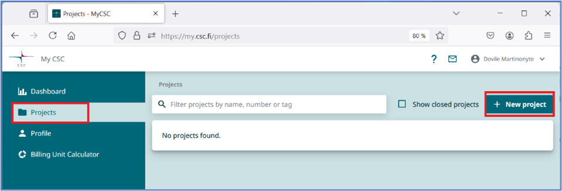

After this select correct project type which in our case **`Course`** and click **`Next`** button. 
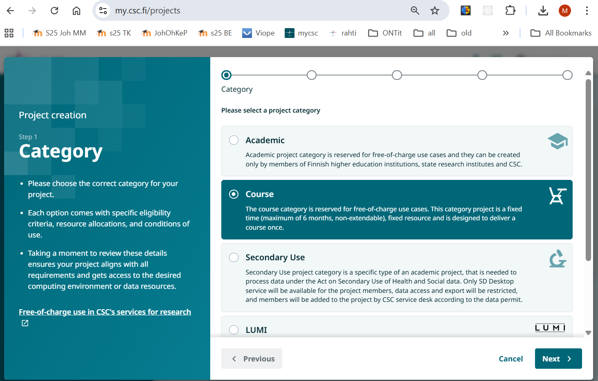


3. Enter the required project details:
  * **`Project name`** and **description**
  * **`Course end date`**: can be at most six months from the creation date.
  * **`Project resources`**:
    + Primary science area: **Engineering and technology**
    + Secondary science area: **Other engineering and technologies**

**Note: Personal data must not be stored in course project services.**

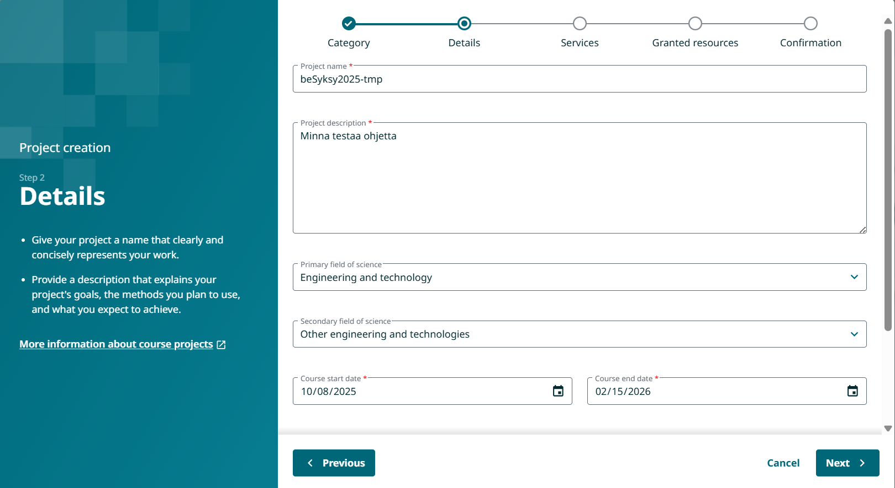

4. Add services to your project. In this course, you will need the Rahti service from CSC’s offerings. 

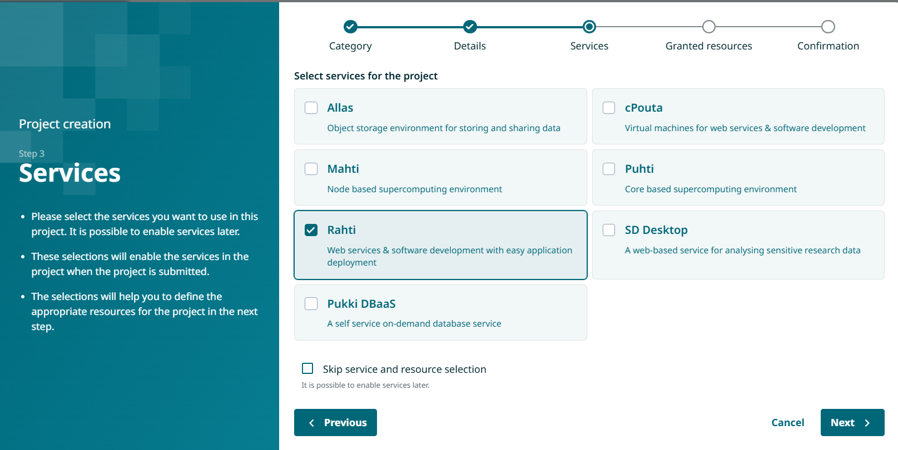

Approve this informative billing page, no need to do any actions just click Next

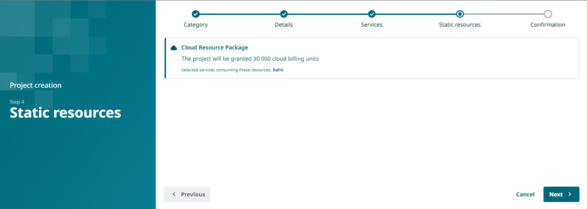

5. Accept all terms of use for the Rahti and click **`Submit`** button. NOTE! It may take several minutes for the project to generate.

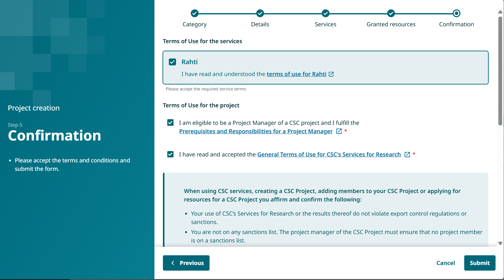

6. Now you should have screen which contains  basic information about your project with the Rahti service
   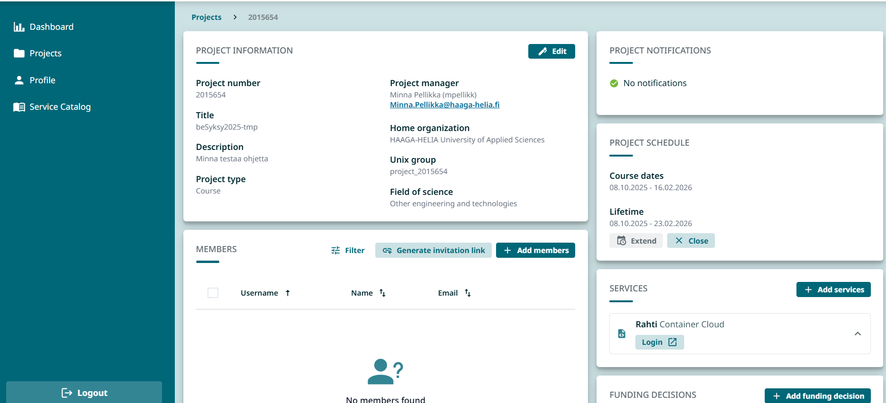
7. In the **`Services`** card, you will now see **`Rahti Container Cloud`** service. Log in to the Rahti service by clicking the **`Login`** button.

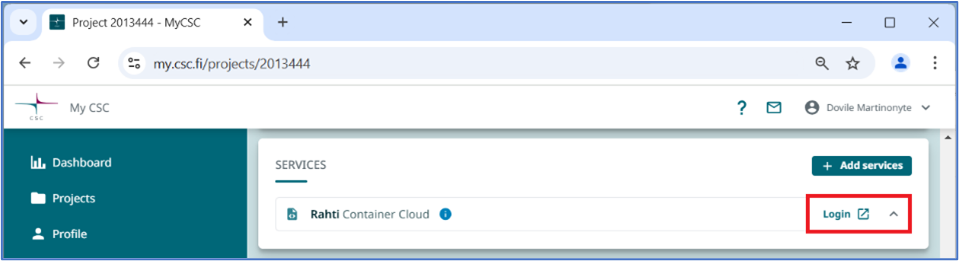

A new tab <https://rahti.csc.fi/> will open in your browser. Click the **`Login`** button.

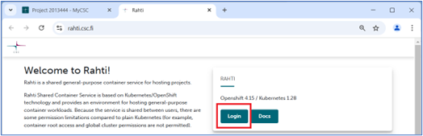

Click **`Login`** and sign in using your **`CSC`** or **`Haka credentials`**.

<p float="left">
  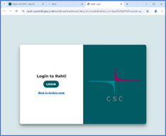
   
</p>

**Note**: if you have registered to my.csc.fi just before following these instructions, it may take some time for your account to activate, so you might see an error message: “Could not find user”. Try going back to the Rahti service login step after a while.


Once your login is successful, you can get started with a tour to improve your workflow or skip it.

# 2 Deploy a Spring Boot Application with an H2 database on Rahti

## 2.1 Prepare your Spring Boot Application

1. Create a new file in the **`root`** directory of your Spring Boot application and name it **`Dockerfile`** (without a file extension).
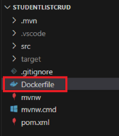
Copy the following content into the **`Dockerfile`** (this can also be found in the course’s Moodle page):
```
# Build-vaihe
FROM eclipse-temurin:17-jdk-focal AS builder

WORKDIR /opt/app

# Kopioi Mavenin asetukset ja projektin metadata
COPY .mvn/ .mvn
COPY mvnw pom.xml ./
RUN chmod +x ./mvnw

# Lataa riippuvuudet
RUN ./mvnw dependency:go-offline

# Kopioi lähdekoodi
COPY ./src ./src

# Buildaa projekti
RUN ./mvnw clean install -DskipTests

# Kopioi JAR-tiedosto suoraan (ei käytetä find-komentoa)
RUN cp target/*.jar /opt/app/app.jar

# Runtime-vaihe
FROM eclipse-temurin:17-jre-alpine

WORKDIR /opt/app

# Kopioi buildattu JAR-tiedosto
COPY --from=builder /opt/app/app.jar /opt/app/app.jar

EXPOSE 8080

ENTRYPOINT ["java", "-jar", "/opt/app/app.jar"]
```
2. Check that your application.properties content is correct (for H2 purpose). If you have in the main class **@Bean CommandLineRunner** make sure the code checks that no duplicate data is entered into the database. Like example below:

```
//Check if there is already user data in the database
if (userRepository.count() == 0) {
  	// Create application user
	User user1 = new User("user", "$2a$06$3jYRJrgKU5uo6", "USER");
	userRepository.save(user1);
}
```

3. Push your updated application to GitHub.

**Note:** These instructions assume your GitHub repository is **public.** *(If needed, you can make it public temporarily during deployment and switch it back to private later.)*

Private repositories can also be used, but this document does not cover that method.

## 2.2 Spring Boot application deployment

1. Navigate to the top left menu. Choose  **`Home`** 🡪 **`Projects`** and click the **`Create Project`** button. 

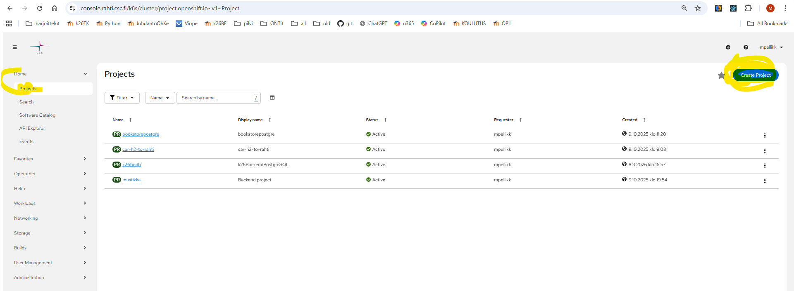

2. Enter the required details. **`Name`** must be **unique** and it is **case sensitive**. Click **`Create`** button.

**Note:** To successfully create the project, you must enter the **CSC project number** (e.g. **`csc\_project:<project number>`**) in the **`Description`** field.
  
If you don’t know project number, see **step 1.4**.

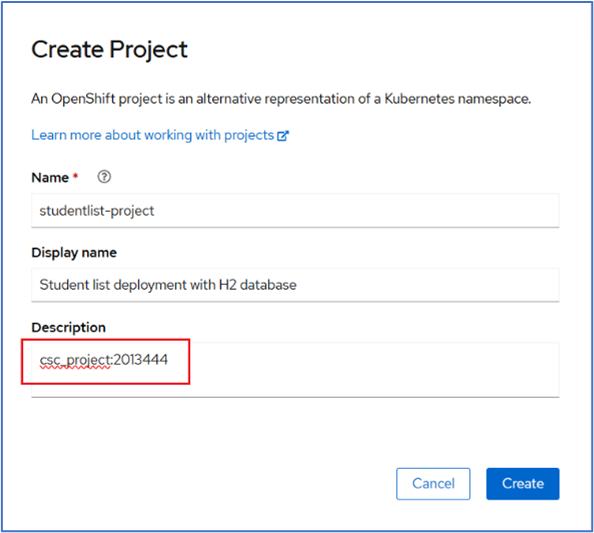

3. Now you can deploy your Spring Boot application inside the newly created project in the Rahti service. Click the small **`+`** icon in the top-right corner.  And select **`Import from git`**.

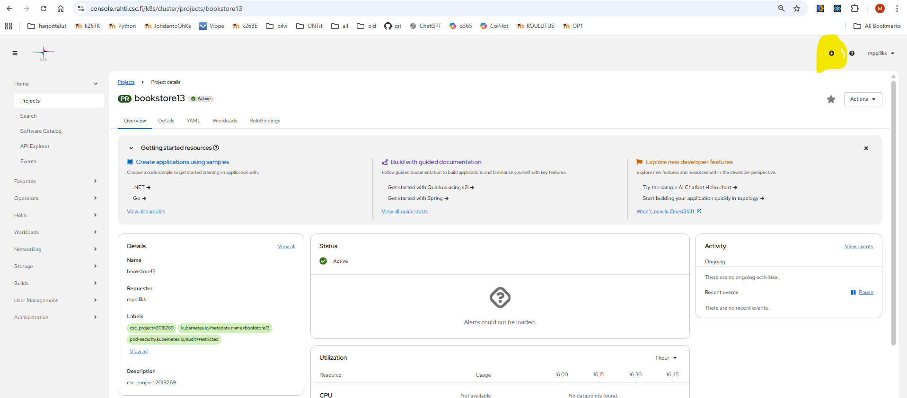

4. Fill in the **Import from Git** form by entering the **`Git Repo URL`**.

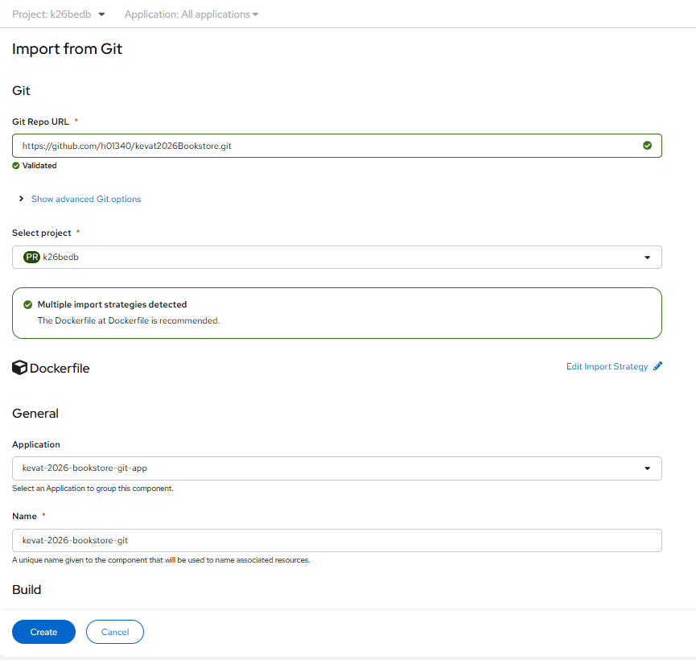

If your repository contains multiple projects, open **`Advanced Git options`** and specify the path to the root folder in the **`Contenxt dir`** field:
A name for your application component in **`Name`** field generated automatically but you can also create your own **unique name**. This component will be used to name associated resources.

Then click the **`Create`** button.

5. The build process will start and may take a few minutes. You can check build process from **`Topology`** view by clicking **`build`** symbol.
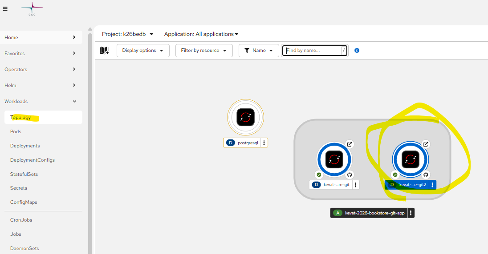
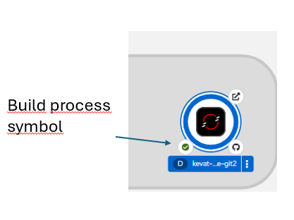

6. Once the build is complete, the status will change to **`green`** and in the log is text like "Successfully pushed image-registry.openshift-image-registry.svc:....Push successful"

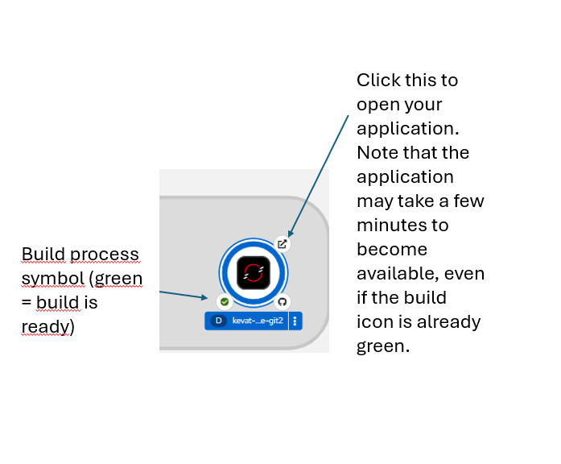


Congratulations, your application is deployed!

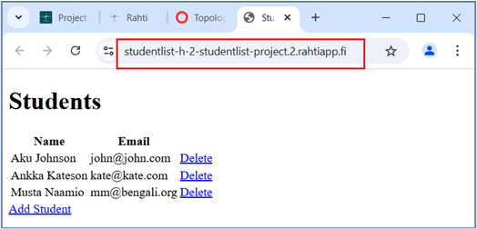


