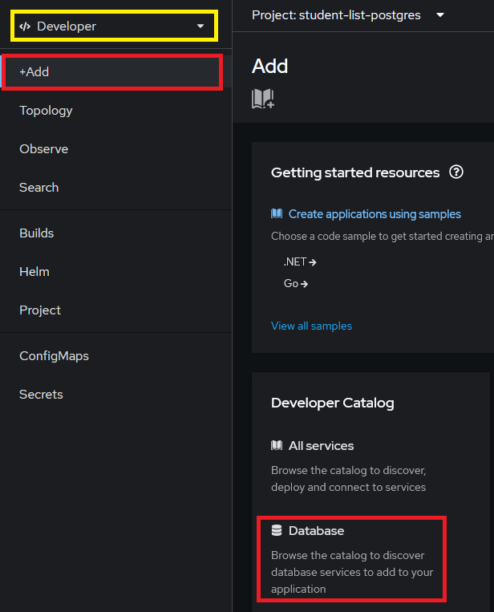
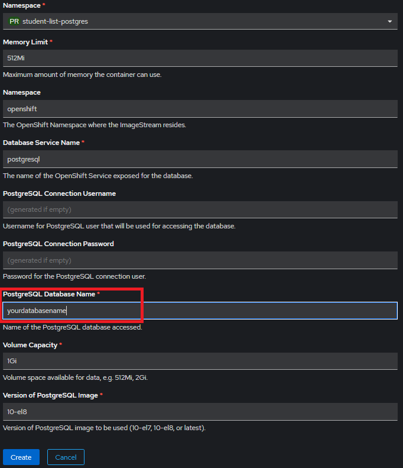

# Deployment: Spring Boot application with Postgresql database

# 1 Configuring Java + Maven + Spring project for deployment

Add PostgreSQL driver as dependency in your project’s **`pom.xml`**. Copy and paste the below snippet, place it as a child element of **`<dependencies>`** element.

```xml
<dependency>
  <groupId>org.postgresql</groupId>
  <artifactId>postgresql</artifactId>
  <scope>runtime</scope>
</dependency>
```

Create a file named **`Dockerfile`** (no file extension) in your coding project’s root. Content of the **`Dockerfile`** for a **`Java + Maven`** project is (use Copy + Paste):

```
FROM eclipse-temurin:17-jdk-focal as builder
WORKDIR /opt/app
COPY .mvn/ .mvn
COPY mvnw pom.xml ./
RUN chmod +x ./mvnw
RUN ./mvnw dependency:go-offline
COPY ./src ./src
RUN ./mvnw clean install -DskipTests
RUN find ./target -type f -name '\*.jar' -exec cp {} /opt/app/app.jar \; -quit
FROM eclipse-temurin:17-jre-alpine
COPY --from=builder /opt/app/\*.jar /opt/app/
EXPOSE 8080
ENTRYPOINT ["java", "-jar", "/opt/app/app.jar" ]
```

The above content is a generalized **`Dockerfile`** configuration and can be used for other Spring Boot projects.

Create a new deployment profile for your application. You need to create a new file in the
**`<your app>/src/main/resources/`** directory.

Name the new file **`application-rahti.properties`**.

Content of the **`application-rahti.properties`** is (use Copy + Paste):

```
spring.datasource.url=jdbc:postgresql://${POSTGRESQL_SERVICE_HOST}:${POSTGRESQL_SERVICE_PORT}/${DB_NAME}
spring.datasource.username=${DB_USER}
spring.datasource.password=${DB_PASSWORD}
spring.jpa.show-sql=true
spring.jpa.generate-ddl=true
spring.jpa.hibernate.ddl-auto=update
```

Commit the above changes and push them to your GitHub repository.

# 2 Creating a project in CSC

**NOTE!** If you already have created a project in CSC, you are unable to create another one. In that case proceed to chapter 3 of these instructions.


Login to CSC at <https://my.csc.fi/login> using you Haka user account (Haaga-Helia credentials) or your CSC user account (username sent to your email). Navigate to Projects view and start creating a new project.


Fill in your project’s information as instructed in the form. Read and accept all terms of use and privacy notice. Choose **`Create project`** to continue.

You have now created your CSC project. Within this project you can start adding CSC’s services. For your deployment you only need **`Rahti – Container Cloud`**. Click **`Add services`** and select **`Rahti`**.

**NOTE: check your project number. You will need it later!**


Once you have added the **`Rahti`** service you might have to wait up to 60 mins for you to gain access after activation. So be patient!

# 3 Creating a project in Rahti

After you have gained access to **`Rahti`** service, you can login to **`Rahti`** at your CSC project’s **`Projects`** view. Choose your (only) project and scroll down to **`Services`**. Clicking **`Login`** will take you to **`Rahti`** landing page.


Continue the login process, you need to click **`Login`** buttons a few times in different pages. Use either Haka or CSC as your authentication method when prompted.

Successfully logging in directs you to **`Rahti`** console. When starting the console for the first time take the site’s tour showing important navigation options. After the tour you are ready to create your **`Rahti`** project.

Click the **`Project: All projects`** dropdown menu and choose **`Create Project`** or click the text **`Create a Project`**. If you don’t have these options visible in your page, make sure you are in **`Developer`** view (marked with yellow).

**NOTE!** You can have more than one **`Rahti projects`** in one **`CSC Project`**.


Give your project a name and a display name. In the description write **`csc_project:<your CSC project number>`**. You will find your **`CSC project number`** in your CSC Project’s **`Project information`** view. Proceed by clicking **`Create`**.


# 4 Creating a Postgresql database instance

After creating a project in Rahti it’s time to create a new database instance for your application.

In **`Developer`** view, go to **`+Add`** page and start creating a database for your project. Choose **`PostgreSQL`**. Make sure you **don’t select the Ephemeral** version! Click **`Instantiate Template`** to continue the process.

You can leave all the default values in the form where you create your database. Leaving **`PostgreSQL Connection Username`** and **`Password`** empty will make the system generate random credentials for you. This is fine within the scope of Haaga-Helia UAS course work.

If you want to specify **`PostgreSQL Connection Username`** and **`Password`**, 

⚠️ **don’t use a weak password! Always use strong passwords even when practicing!** ⚠️

<p float="left">
  
   
</p>

Successful creation of a database will show as a new **`DeploymentConfig`** object in your **`Topology`** view.


The next step is to include your SpringBoot application into your Rahti project.

# 5 Including SpringBoot application into Rahti

You will need to have your SpringBoot application in GitHub before continuing these instructions. The following instructions assume that you have set your GitHub repository **Public**.

In **`Rahti`** dashboard make sure you are in **`Developer`** view: go to **`+Add`** page and choose **`Import from Git`**.


Copy and paste your GitHub repository’s URL into the corresponding form field and choose **`Dockerfile`** as your **`Import Strategy`** if it is not the suggested one. You can leave rest of the form fields to their default values. Move on to **`Create`**.


**NOTE!** **`Rahti`** might not detect the **`Dockerfile`** if it is not in your GitHub project’s root. In this case open **`Show advanced Git options`** under **`Git Repo URL`** form field. In **`Context dir`** form field update the value to the name of the subdirectory that contains **`pom.xml`** and **`Dockerfile`**.


Successful creation will take you to your project’s **`Topology`** view. Click the graphical representation of your deployment to open your deployment controls.


You have now deployed your application into **`Rahti`**. But it is not in working condition yet. You still need to configure the environment variables for the JDBC connection.

# 6 Configuring environment variables

In **`Administrator`** view: **`Workloads`** 🡪 **`Deployments`** 🡪 **`<your deployment>`** 🡪 **`Environment`**.

Set your environment variables as shown below. Click the circled **`Add from ConfigMap or Secret`** to get more form fields. Click **`Save`** at the bottom of the page to activate your changes.


Congratulations! You have now deployed your Spring application with a proper database to CSC/Rahti!

To get the URL for your app go back to **`Developer`** view 🡪 **`Topology`**. Click your application’s **`Open URL`** shortcut or navigate to deployment’s quick controls (navigation pane on the right) and scroll down to **`Routes`**. It might take few minutes before you are able to access your deployment’s URL in browser.


[Renne Jämsén](https://github.com/RenneJ) & [Dovile Martinonyte](https://github.com/dovile-mart) 2025-05-15
