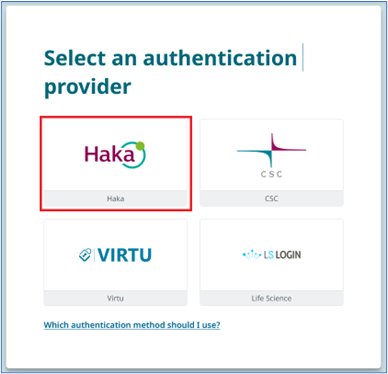
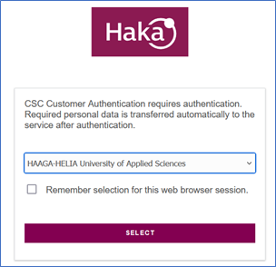
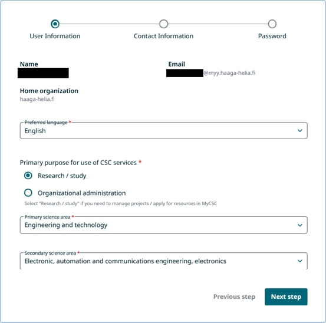
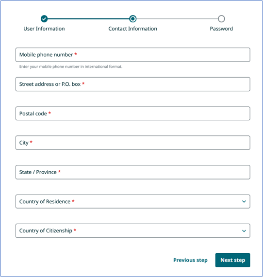
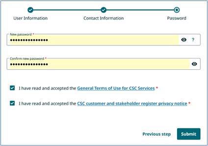
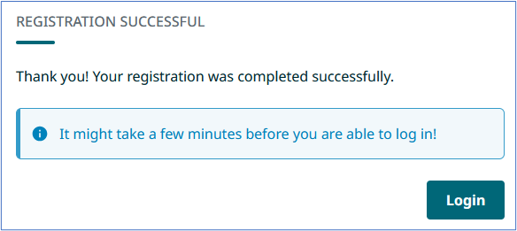
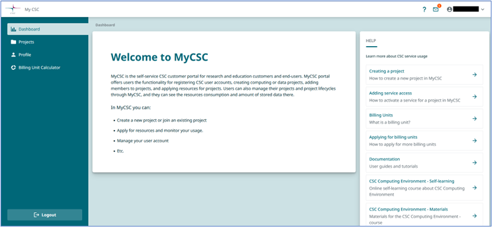

# Registering to CSC

Navigate in your web browser to <https://my.csc.fi/login>. Select **Haka** as an authentication provider and in the next view choose **HAAGA-HELIA University of Applied Sciences** in the dropdown menu.

 
 
 

Give your Haaga-Helia credentials when prompted (bxx000 + password). After authentication you will start to create a new profile to CSC’s platform. Match your selections to the image below and proceed to **Next step.**

Fill the form with your contact information and proceed to **Next step.** You can also use Haaga-Helia’s information but use **your own phone number**.

>Mobile phone number: Your own
>
> Street address: Ratapihantie 13
> 
> Postal code: 00520
>
> City: Helsinki
>
> State/province: Uusimaa
>
> Country of Residence: Finland
>
> Country of Citizenship: Your own

Choose a new password. Read and accept the terms of use and privacy notice.

After submitting your information, you might have to wait 0-30 minutes before you can log in to your new CSC account. CSC will send you a confirmation message. Check the message for your new CSC username. The username is derived from your own name.

From now on you can choose either Haka or CSC as your authentication provider when you login to <https://my.csc.fi/login>.

If you prefer Haka, use your Haaga-Helia credentials.

If you prefer CSC, check your email for your CSC Username and use the password you chose during profile creation.

Successful login will redirect you to this page:

Dovile Martinonyte & Renne Jämsén 2025-05-14
