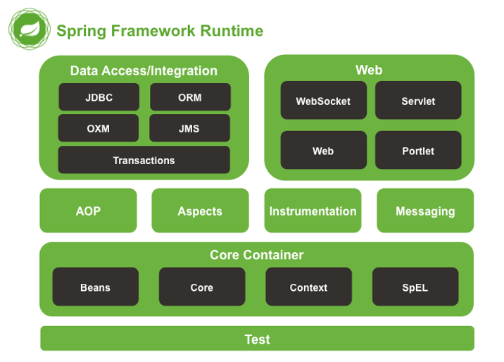
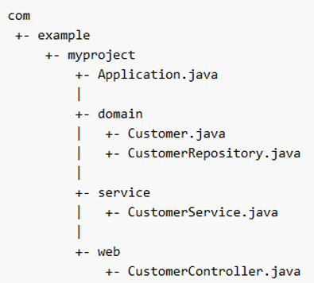
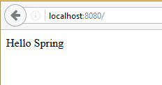
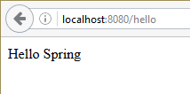
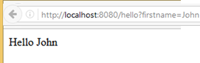
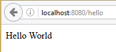

<!-- Slide number: 1 -->
# Back End Programming: Spring Boot Introduction
Juha Hinkula and Jukka Juslin
Updated Minna Pellikka 

<!-- Slide number: 2 -->
## Spring Framework

- Spring framework: https://spring.io/
- Spring framework is an open source application framework for Java platform
- The most popular framework for Java EE
- First version was released under Apache 2.0 license in 2003
- Spring is modular and it contains lot of extensions for different purposes

<!-- Slide number: 3 -->
## Spring Documentation

- Material
   - Getting Started Guides: https://spring.io/guides
   - Tutorials: https://spring.io/guides#tutorials
   - Tutorialspoint: http://www.tutorialspoint.com/spring/

<!-- Slide number: 4 -->



<!-- Slide number: 5 -->
## Dependency Injection (DI)

- Web appliction typically contains object that have dependencies to each others
- Dependency injection helps interaction between classes but same time keeping them independent

<!-- Slide number: 6 -->
## Dependency Injection (DI) example

- Without DI

```
public class Vehicle {
   private Owner owner;

   public Vehicle() {
      owner = new Owner();
   }
}
```

- With DI

```
public class Vehicle {
   private Owner owner;

   public Vehicle(Owner owner) {
      this.owner = owner;
   }
}
```

<!-- Slide number: 7 -->
## Spring Boot

- Spring Boot helps to easily setup new Spring project
- Create stand-alone Spring applications
   - Embedded application server
- Starter POM’s for Maven configuration
- Minimized the need of configuration

<!-- Slide number: 8 -->
## Maven

- Apache Maven is a software project management and comprehension tool
- https://maven.apache.org/
- Maven objectives
   - Easy build process
   - Uniform build system
   - Transparent migration of new features
   - Guidelines for best practice development

<!-- Slide number: 9 -->
## Maven and pom.xml

- Maven in 5 minutes: https://maven.apache.org/guides/getting-started/maven-in-five-minutes.html
- The pom.xml file is the core of the project configuration in Maven
- Single configuration file to build a project

<!-- Slide number: 10 -->
## POM.XML example

```
<?xml version="1.0" encoding="UTF-8"?>
<project xmlns="http://maven.apache.org/POM/4.0.0" xmlns:xsi="http://www.w3.org/2001/XMLSchema-instance" xsi:schemaLocation="http://maven.apache.org/POM/4.0.0 http://maven.apache.org/xsd/maven-4.0.0.xsd">
   <modelVersion>4.0.0</modelVersion>
   <groupId>fi.haagahelia.course</groupId>
   <artifactId>helloFormValidation</artifactId>
   <version>0.0.1-SNAPSHOT</version>
   <packaging>jar</packaging>

   <name>helloFormValidation</name>
   <description>Demo project for Spring Boot</description>

   <parent>
      <groupId>org.springframework.boot</groupId>
      <artifactId>spring-boot-starter-parent</artifactId>
      <version>3.4.1</version>
      <relativePath/> <!-- lookup parent from repository -->
   </parent>
   <url />
   <licenses>
      <license />
   </licenses>
   <developers>
      <developer />
   </developers>
   <scm>
      <connection />
      <developerConnection />
      <tag />
      <url />
   </scm>

   <properties>
      <java.version>17</java.version>
   </properties>
   <dependencies>
      <dependency>
         <groupId>org.springframework.boot</groupId>
         <artifactId>spring-boot-starter</artifactId>
      </dependency>

      <dependency>
         <groupId>org.springframework.boot</groupId>
         <artifactId>spring-boot-starter-web</artifactId>
      </dependency> …..
```

<!-- Slide number: 11 -->
## Recommended Structure of Spring Boot Project
- NOTE! locate the main application class in a root package above other classes. Otherwise your application won’t work properly



<!-- Slide number: 12 -->
## First Spring Boot project
- Create a new Spring Boot project according to instructions in course site
- Add new controller class HelloController.java (code in next slide)
- Run your project and browse to localhost:8080




<!-- Slide number: 13 -->
## Hello Controller

```
import org.springframework.stereotype.Controller;
import org.springframework.web.bind.annotation.RequestMapping;
import org.springframework.web.bind.annotation.ResponseBody;

@Controller
@ResponseBody
public class HelloController {

    @RequestMapping("*")
    public String hello() {
        return "Hello Spring";
    }
}
```

<!-- Slide number: 14 -->
## Spring Boot & Spring web MVC

- Spring uses annotations (starts with ’@’-sign) for configuration
- `@Controller` annotation
   - Marks class as a Spring web MVC controller
- `@ReponseBody` annotation
   - Converts the return value and write it to http response
- `@RequestMapping` annotation
   - Mapping URLs to controller methods

<!-- Slide number: 15 -->
## Spring Boot and Request Mapping

- `@RequestMapping("*")` means for any path in the application will excecute hello() method.
- Change the code `@RequestMapping("/hello")` means that path `address:port/hello` excecutes hello() method.



<!-- Slide number: 16 -->
## Request Parameters

- HTTP GET request can contain parameters
- Example
   - `http://localhost:8080/hello?firstname=John&lastname=Doe`
- In HTTP POST request parameters are sent in the request body

<!-- Slide number: 17 -->
## @RequestParam Annotation

- `@RequestParam` annotation binds the value of request parameter into name variable

```
@Controller
@ResponseBody
public class HelloController {
    @RequestMapping("/hello")
    public String hello(@RequestParam(name="firstname") String firstName) {
        return "Hello " + firstName;
    }
}
```



<!-- Slide number: 18 -->
## Configurating of @RequestParam Annotation

- In the previous example the parameter is mandatory. If it is not required you can use following parameters in `@RequestParam` annotation

```
public String hello(@RequestParam(name="firstname", required=false, defaultValue="World") String firstName)
```

- If the request does not contains parameter the default value is used



<!-- Slide number: 19 -->
## Spring Boot Application

- Spring Boot packs everything to one executable JAR package
- Excecution starts from the main application class (main() method)

```
package hello;

import org.springframework.boot.SpringApplication;
import org.springframework.boot.autoconfigure.SpringBootApplication;

@SpringBootApplication
public class Application {
    public static void main(String[] args) {
        SpringApplication.run(Application.class, args);
    }
}
```

<!-- Slide number: 20 -->
## Annotations for Spring Boot Application Class

- `@SpringBootApplication` annotation adds following annotations
   - `@Configuration` tags the class as a source of bean definitions for the application context.
   - `@EnableAutoConfiguration` tells Spring Boot to start adding beans based on classpath .
   - `@ComponentScan` tells Spring to look for other components, configurations, and services in the package
   - `@EnableWebMvc` annotation flags the application as a web application and activates key behaviors such as setting up a DispatcherServlet
