<!-- Slide number: 1 -->
# VS Code: Spring boot projektin luominen

<!-- Slide number: 2 -->
# Spring boot projektin luominen

Tässä lyhyesti ohjeet, seuraavalla sivulla tarkemmat ohjeet näyttökuvien kera.

1. Spring boot projekti luodaan suoraan Visual Studio Codessa. Sinulla pitää olla kaksi laajennosta (extensions) asennettuna: Spring Boot Extension Pack sekä Extension Pack for Java.
2. Projektin tietojen syöttäminen:
  - Mene kansioon, jonne haluat projektin luoda
  - ctrl + shift + p näppäinyhdistelmällä saat vs code ruudun yläreunaan command valikon -> kirjoita sinne ”Spring initialzer: Create a Maven project”
  - Valitse SB versio on 3.4.1
  - Valitse tämän jälkeen kieleksi Java
  - Anna projektillesi group id (paketti, package), esim. kevat25
  - Anna artifact (projektin nimi), esim. backend
  - Valitse paketointityypiksi JAR
  - Javan versio on 17
  - Valitse dependecyt (riippuvuudet, kirjastopaketit) ja hyväksy ne enterillä
  - Hyväksy projektin generointi kansioon, jonka valitsit a-kohdassa

3. Koodin lisääminen projektiin ja sovelluksen käynnistäminen

<!-- Slide number: 3 -->
# 1 Käynnistä Visual Studio Code ja asenna tarvittavat laajennokset

Valitse kuvien mukaiset laajennokset (extensios) Spring Boot projektia varten

|||
|--|--|

<!-- Slide number: 4 -->
# 2 Syötä projektin tiedot

Projektin tietojen syöttäminen:

- Mene kansioon, jonne haluat projektin luoda (VS Code: open folder)
- ctrl + shift + p näppäinyhdistelmällä saat vs code ruudun yläreunaan command valikon -> kirjoita sinne ”Spring initialzer: Create a Maven project”
- Valitse opettajan ohjeistama Spring boot versio (esim. keväällä 2025 se on 3.4.1)

- Valitse tämän jälkeen kieleksi Java
- Anna projektillesi group id (paketti, package), esim. kevat25
- Anna artifact (projektin nimi), esim. backend
- Valitse paketointityypiksi JAR
- Javan versio on 17
- Valitse oikeat dependecyt (Spring web, Spring Boot Dev Tools)

> Paketin avulla voimme luoda webbisovelluksia, käyttää MVC-arkkitehtuuria, sisältää sisäisen Tomcatin
> 

> Paketin avulla voimme esim. tehdä koodiin muunnoksia ilman, että meidän pitää käynnistää tomcat palvelin uudelleen. Muunnokset ovat siten heti ajonaikana  käytettävissä.
> 

- Generoi projekti kansioon, jonne haluat projektin luoda

<!-- Slide number: 7 -->
# 3 Koodin lisääminen projektiisi

VS Code ruudulla näkyy uusi projekti. Jos ei näy, niin avaa kansio seuraavasti: VS Code -> File -> Open Folder)

Ruudulla näkyy nyt Backend projektisi pohja, johon voit koodata toiminnallisuutta

Ns pääluokka on generoitunut automaattisesti Spring Boot kehikon toimesta. Annotaatio `@SpringBootApplication` varmistaa mm. sen, että sovellus lukee projektin kaikki kontrollerit ja palvelut. Huolehtii, että ”lennossa” lisätyt paketit (esim. validation) toimivat ilman sovelluksen uudelleen käynnistämistä

|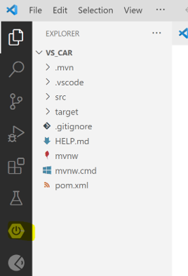|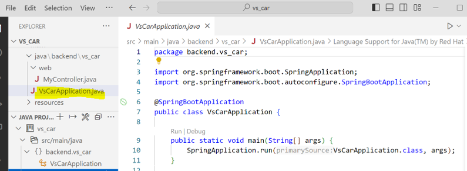|
|--|--|

<!-- Slide number: 9 -->
## Sovelluksen toiminnallisuuden periaatteet

- Tällä hetkellä meillä on sovellus, jossa on runko valmiina, muttei toiminnallisuutta.
- Lisätään toiminnallisuus, jonka tuloksena nettisivulle tulostuu lause ”Spring Boot sovellukseni!”
- Luodaan tätä varten palvelinohjelmaamme ns. controller luokka. Controller luokka vastaanottaa palvelimeen (server) kohdistuvat asiakkaan (client) pyynnöt. Controller luokka tekee – tai mieluummin pyytää jotain muuta tahoa tekemään työt ja palauttaa palautteen (response) clientille

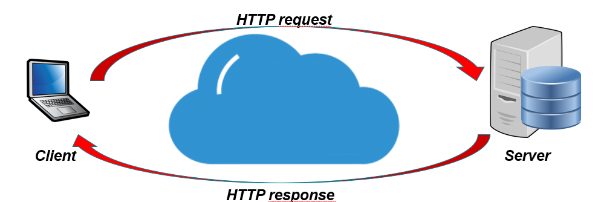

<!-- Slide number: 10 -->
## 3 Koodin lisääminen projektiisi, jatkuu

|a) Tarkista, että olet aktivoinut Java Projects näkymän|b) Luo uusi paketti ao kuvan mukaisesti |
|-|-|
|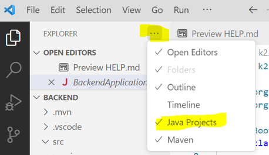|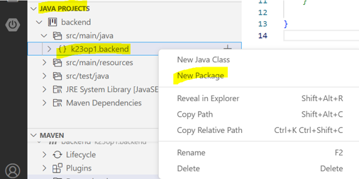|
|c) Anna paketille nimeksi web, laitamme sinne ns controller luokkia|d) Luo uusi java luokka. Anna Luokalle nimeksi MyController.java. Luokkaan lisättävä koodi esitetään seuraavalla sivulla.|
|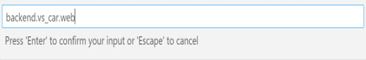 |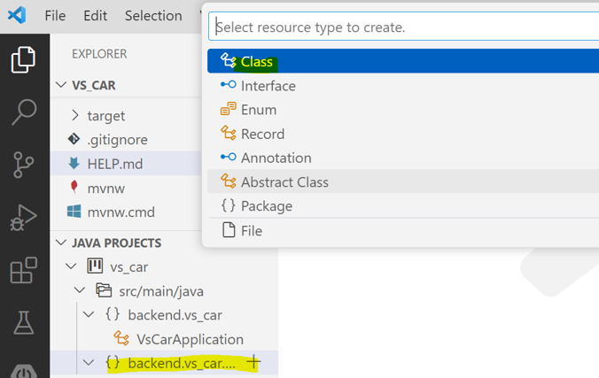 |

Spring Bootissa kerrotaan `@` annotaatioilla seuraavat asiat

- `@Controller`: Tämän ns. kontrolleriluokan metodit pystyvät käsittelemään clientin pyynnöt/requestit ja välittämään niille vastaukset/responset.
- `@RequestMapping`: Kerrotaan, mistä osoitteesta tulevat pyynnöt käsitellään kyseisessä metodissa. Tässä esimerkissä käytetään ”main” merkkijonoa. Joten, jos kirjoitat selaimeen urliin `http://localhost:8080/main`, niin kutsu ohjautuu tähän returnMessage-metodiin.
- `@ResponseBody`: Palaute clientille esitetään sellaisenaan eli esimerkissä ”Eka SB sovellukseni”.

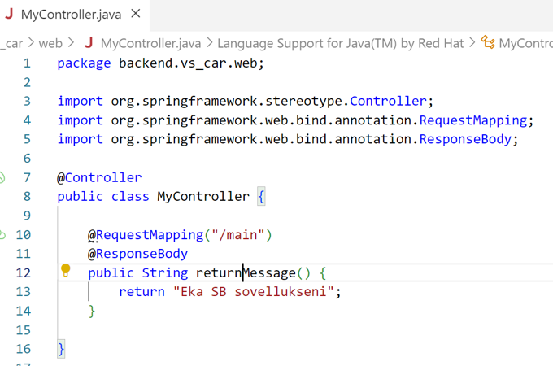

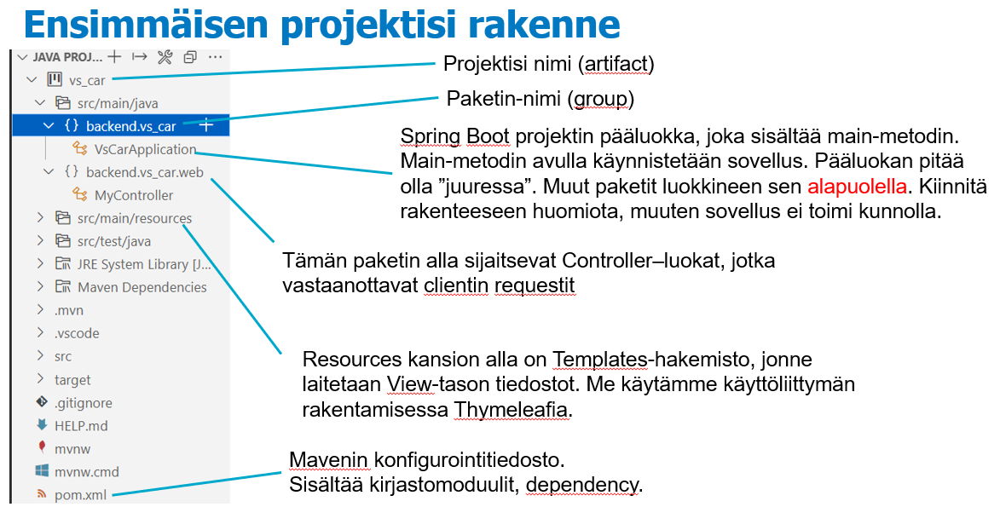

## Sovelluksen käynnistäminen

Spring Boot sovelluksen käynnistäminen voi tapahtua esim. alla vasemmalla olevan kuvan mukaisessa näkymässä. Ks keltaisella väritetyt.

TAI

Sovelluksen voi käynnistää myös menemällä Explorer näkymässä projektin pääluokan päälle ja valitsemalla pop-up valikosta Run Java. Ks kuva alla oikealla.

|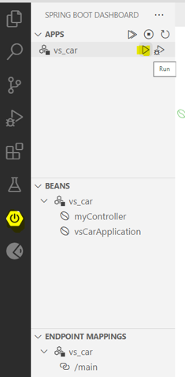|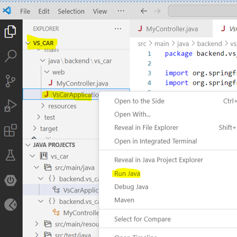|
|-|-|

<!-- Slide number: 15 -->
## Sovelluksen ajaminen

Terminal näkymästä näet, milloin Tomcat ja sovelluksesi ovat käynnistyneet.

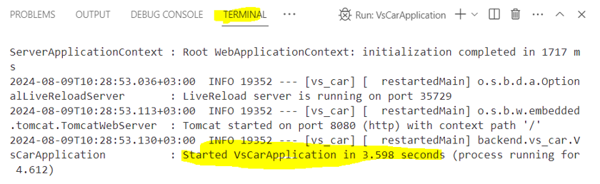

Kirjoittamalla selaimen osoitekenttään (url:iin) `http://localhost:8080/main` lähetät requestin/kutsun sovelluksellesi ja näet responsen ruudulla

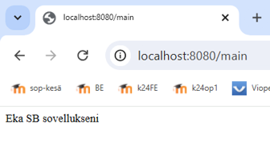

## Lisää toiminnallisuutta

Lisätään `MyController` luokkaan toiminnallisuus, jonka tuloksena nettisivulle tulostuu ”Hei <nimi>!”
<nimi> paikalle tulee nimi, jonka annat url:ssa parametrinä

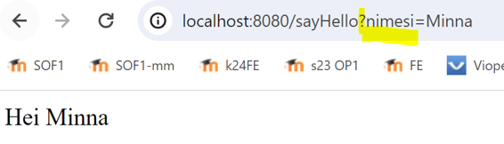

`@RequestParam` annotaation avulla sidomme urlin mukana tulevan parametrimuutujan `nimesi` arvon (esimerkissä Minna) Java puolella muuttujaan `etunimi`

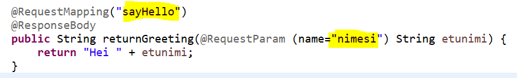

Muokataan toiminnallisuus siten, että jos nimeä
ei anneta, niin tulostetaan jokin oletusarvo.

`MyControllerissa` on tätä vastaava koodi

`@RequestParam`:lle voidaan antaa attribuutteja. Esim. `required`-attribuutilla kerrotaan, ettei nimi-parametri ei ole pakollinen, `defaultValue` kertoo oletusarvon.

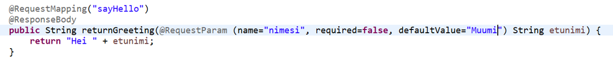

Muokataan toiminnallisuutta siten, että nimen lisäksi annetaan myös ikä

|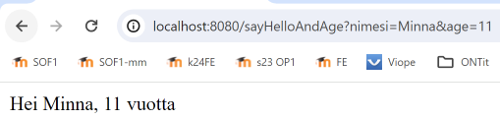|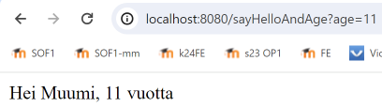|
|-|-|

MyControllerissa on tätä vastaava koodi

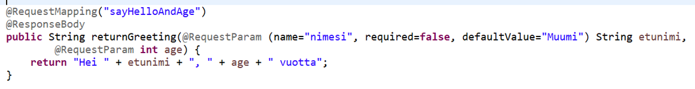
