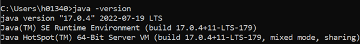
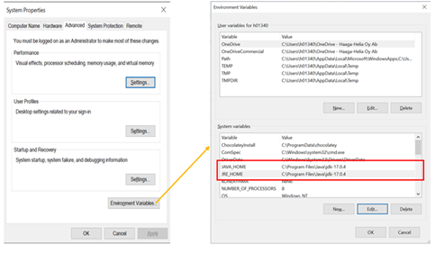
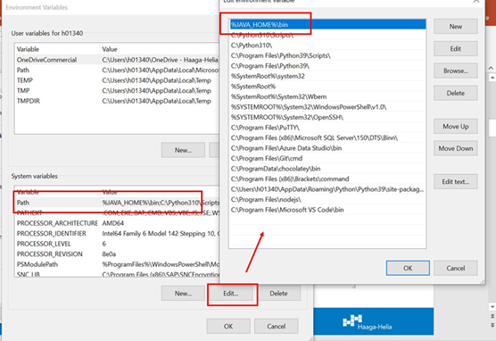

# Java 

Varmista, että koneellasi on java 17, esim. command promptin kautta:

Jos javaa ei ole, niin asenna se:
<https://www.oracle.com/java/technologies/downloads/#java17>

Tarkista myös koneesi ympäristömuuttujista, että PATH-määrittelyt ovat
oikein. Alla omasta ympäristöstäni kuvakaappaukset. (Avaa ”Edit the
system environment variables” -ikkunan ja sieltä Environment Variables
buttonin kautta pääset tekemään tarvittavat konfiguroinnit).

Tarkista myös Path muuttujan sisältö:

