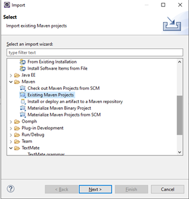
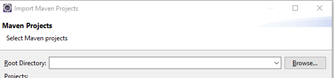
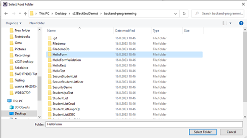
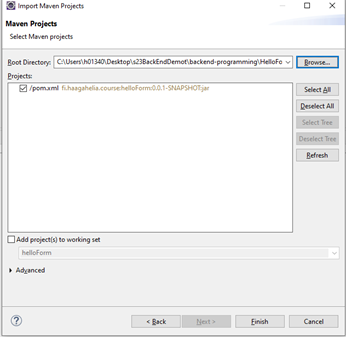
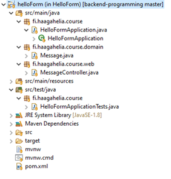
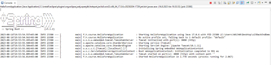

# Haaga-Helia: Back End Programming

## Course demos can found from the GitHub:

https://github.com/Haaga-Helia-SOF003AS3A/backend-programming

## How to run demos

1. Clone the repository to your computer
   1. Open the PowerShell (Windows) or terminal (Mac, Linux)
   2. Navigate to the folder where you want to clone demos
   3. Type command
      ```
      git clone https://github.com/Haaga-Helia-SOF003AS3A/backend-programming
      ```
2. Open Eclipse and import one of the demo projects.
   1. Select File -> Import -> Maven -> Existing Maven Project
      - 
   2. Press ’Next’ button
   3. Press ’Browse’ button
      - 
   4. Select HelloForm project from the cloned backend-programming folder (click ‘Select Folder’ button)
      - 
   6. And finally, click ‘Finish’ button and the project will be imported to Eclipse (Note! Check that there is pom.xml file). This may take some time.
      - 
   7. After import you should see the following project structure in Eclipse
      - 
   8. Run Spring Boot project class by pressing ‘Run’- button in Eclipse
   9. You should see following banner in Eclipse Console
      - 

**Note!** Check endpoint from the controller class For example

```
@RequestMapping(value="/hello", method=RequestMethod.GET)
public String greetingForm(Model model) {
   model.addAttribute("message", new Message());
   return "hello";
}
```

You can access your application by browsing to address <http://localhost:8080/hello>

Repeat same steps to all demos that you want to run.
