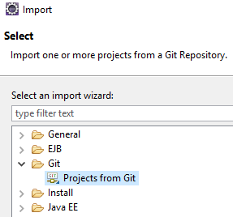

# GitHub

# Moving existing project to GitHub

Note! Git installation is needed before going through this tutorial

1. Login to GitHub and create new repository (Do not select ‘Initialize this repository with a README’)
2. Copy the repository URL (You will need that later)
3. Open PowerShell or GitBash
4. Change the current working directory to your local project
5. Initialize the local GIT repository by using git command
   ```
   git init
   ```
6. Add the files to new repository by using git command
   ```
   git add .
   ```
7. Commit the files with comments
   ```
   git commit -m “First commit”
   ```
8. Change your GitHub repository to your remote repository (Use URL from step 2)
   ```
   git remote add origin Your\_Github\_Repository\_URL
   ```
9. Push the changes to GitHub
   ```
   git push -u origin main
   ```

Finally you should see your project in your repository Code page.

# Cloning your project to your computer manually (Option A)

You can clone your project from the GitHub and start making changes to it. After you have cloned your program you can import it to Eclipse.

1. Create a folder for your project and change current to the new folder. Clone your project by using following Git command

```
git clone YOUR\_GITHUB\_REPO\_URL
```

# Cloning your project to your computer with Eclipse (Option B)

You can clone your project from the GitHub and start making changes to it.

1. Open Eclipse
2. Select ‘File 🡪 Import 🡪 Git 🡪 Projects from Git
   - 
3. Select ‘Clone URI’
4. Type in
   1. your GitHub repository URL to URI field
   2. Your Github account and password
5. Click next and keep defaults until the end of the wizard

# Commit changes to GitHub

After you have made changes to your source code, you can send changes to GitHub by using following Git commands

1. Add the changed files by using git command
   ```
   git add .
   ```
2. Commit the files with comments
   ```
   git commit -m “Adding new method…”
   ```
3. Push the changes to GitHub
   ```
   git push -u origin main
   ```
