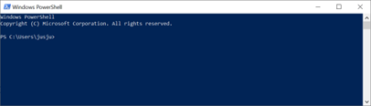

# Peruskomentorivikomennot Windowsilla Powershellissä

Powershellin voi avata hakemalla powershell nimistä ohjelmaa. Ohjelma voi toimia joko Administraattorina eli ylläpitäjänä ajettuna tai normaaleilla käyttäoikeuksilla. Kannattaa ottaa huomioon, että jotkut hakemistot saattavat vaatia admin-tason oikeuksia.

Powershell ikkuna näyttää seuraavanlaiselta PS sana ensimmäisenä.

### Yleiskomennot ”sinisessä” PowerShell ikkunassa
- ylänuoli: edellinen komento
- tabulaattori: komennon automaattinen täydennys

### Komennot komentorivillä
- Hakemistoon siirtyminen `cd HAKEMISTON\_NIMI TAI POLKU`
- Hakemistopuussa ylöspäin: `cd ..`
- Kaikki myös piilotetut .git yms hakemistot näytölle: `dir -Force`

Oppaan tehnyt Jukka Juslin
