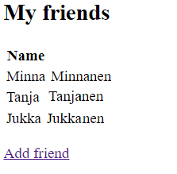
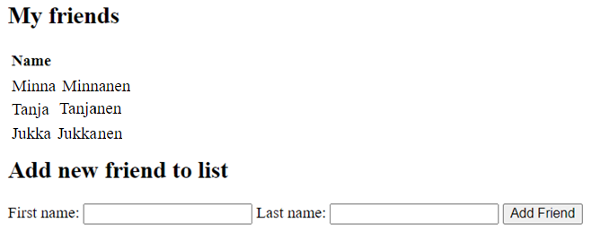

# 1. Hello Thymeleaf

Create Spring Boot application that handle GET request to the path /hello with two parameters called name and age. Create thymeleaf template which shows welcome message if age is greater than 18. See example prints below.

**Tips**. You can use thymeleaf `th:if` attribute for comparison. Use escaped comparison operators (&gt; and &lt;).

Example: `<div th:if="${age} &gt; 17">Show something</div>`

**Examples:**

Request: `http://localhost:8080/hello?name=John&age=20`

Prints: `Welcome John!`

Request: `http://localhost:8080/hello?name=Mark&age=12`

Prints: `You are too young!`

# 2. Handling Lists

Create Spring Boot application that handle GET request to the path `/hello`. Application handles list of students. The application prints welcome message and the list of students.

Steps: Create a new package called domain (inside the root package) and create Student class inside that package. Student class contains two attributes: firstName and lastName.

Create a new package called web (inside the root package) and create a StudentController controller class. Create student objects in the controller and add students to a list. The list will be then added to the model and sent to a view. Finally you have to create view to show students using `th:each`. The screenshot below shows the example project structure (your package name might vary from the example).


**Example:**

Request: `http://localhost:8080/hello`

Prints:
```
Welcome to the Haaga-Helia!
Kate Cole
Dan Brown
Mike Mars
```

# 3. Friend List

1. Create Thymeleaf template which list all friends, see picture below:



`Add friend` -link contains following code

```
<p><a th:href=*"@{/add}"*>Add friend</a></p>
```

2. Create thymeleaf template where you can insert new friend information.


Use html form element which contains 2 input fields and one button. See help from HelloFormValidation demo.

3. Create domain package and Friend class. Friend class contains firstName and lastName.
4. Create FriendController class which handles methods for showing friend list, opening “Add new friend” page and saving new friend information.

# 4. Friend List

Create Thymeleaf template which contains two elements, see picture below:



You need controller class which will handle two kinds of HTTP-requests: GET and POST.

Functionality is pretty much the same like in the previous exercise but now elements are in the same html page.

# 5. Bookstore

We will now start to create our training project. This excercise continues through the whole course and it will be returned to Github.

1. Create a project called Bookstore by using Spring Initializr page (include web, devtools)
2. Add a new controller called BookController which handle get request to the path /index
3. Add a new model class called Book which contains attributes: title, author, publicationYear, isbn, price
4. Add your project to your GitHub account (See the instructions from the moodle)

Follow the recommended Spring Boot project structure.
