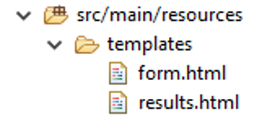
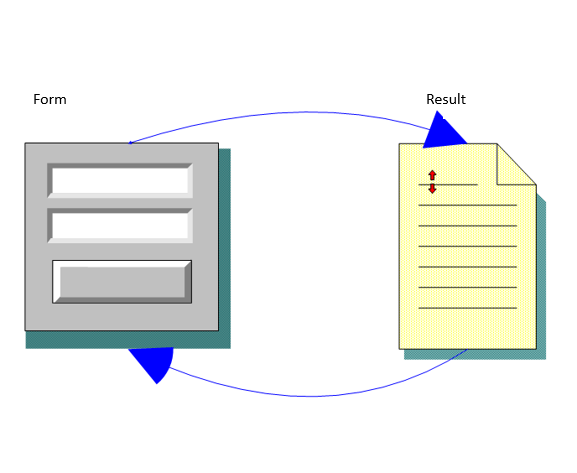

<!-- Slide number: 1 -->
# Back End Programming: Views & Model

<!-- Slide number: 2 -->
# Spring Boot
- Thymeleaf is used for the views during this course
- Thymeleaf is a modern server-side Java template engine for web and standalone environments
- www.thymeleaf.org
- How to start? Add dependency to pom.xml

```xml
<dependency>
	<groupId>org.springframework.boot</groupId>
	<artifactId>spring-boot-starter-thymeleaf</artifactId>
</dependency>
```

<!-- Slide number: 3 -->
- Thymeleaf templates are HTML files that also work as static prototypes
- With Spring Boot Thymeleaf templates are saved to `resources/templates` folder



<!-- Slide number: 4 -->
- Thymeleaf template example (index.html)

```html
<!DOCTYPE html>
<html xmlns="http://www.w3.org/1999/xhtml" xmlns:th="http://www.thymeleaf.org">
	<head>
		<title>Index</title>
		<meta http-equiv="Content-Type" content="text/html; charset=UTF-8" />
	</head>
	<body>
		<h1 th:text="'Hello ' + ${name}">Hello</h1>
	</body>
</html>
```

<!-- Slide number: 5 -->
- Accessing views
	- Controller handles request and returns the name of the View
	- Example below handels request for /index endpoint and returns view called ”index” (index.html Thymeleaf template)
	- **Note!** There is no `@ResponseBody` annotation when using Thymeleaf templates.

 ```java
@Controller
public class MyController {
	@RequestMapping("/index")
	public String home() {
		// do something
		return "index"; // index.html
	}
}
```

<!-- Slide number: 6 -->
- The value of a parameter can be added to the Model object that makes it accessible to the view
- In a typical Spring application, Controller classes are responsible for preparing a model map with data and selecting a view to be rendered

```java
import org.springframework.ui.Model;

@Controller
public class HelloController {
	@RequestMapping("/hello")
	public String greeting(@RequestParam(name="name") String name, Model model)    {
		model.addAttribute("name", name);
		return "hello"; // hello.html
	}
}
```

<!-- Slide number: 7 -->
- In Thymeleaf, the model attributes can be accessed with the following syntax: `${attributeName}`
- Thymeleaf parses the template and evaluates `th:text` expression to render the value of the `${name}` parameter

```html
<!DOCTYPE HTML>
<html xmlns:th="http://www.thymeleaf.org">
	<head>
		<title>Hello</title>
		<meta http-equiv="Content-Type" content="text/html; charset=UTF-8" />
	</head>
	<body>
		<p th:text="'Hello, ' + ${name} + '!'" />
	</body>
</html>
```

<!-- Slide number: 8 -->
- Model can contain the list of object which can be iterated and displayed as a table with Thymeleaf
- In the following example `messageRepository.findAll()` method returns the list of message objects

```java
@RequestMapping("/allmessages")
public String messages(Model model) {
	model.addAttribute("messages", messageRepository.findAll());
	return "messagelist"; // messagelist.html
}
```

<!-- Slide number: 9 -->
- Thymeleaf provides th:each attribute to iterate over the list of objects

```html
<tr th:each="message : ${messages}">
	<td th:text="${message.id}">1</td>
	<td th:text="${message.msg}">Text ...</td>
</tr>
```

<!-- Slide number: 10 -->
- GET request
	- Values are sent in URL in URL’s query string
- POST request
	- Values are sent in the request body
	- Typically used when sending a complete web form or uploading files
- How to define request type in controller?

`@RequestMapping(value="/greeting", method=RequestMethod.POST)`

OR

`@RequestMapping(value="/greeting", method=RequestMethod.GET)`

<!-- Slide number: 11 -->
- Instead of `@RequestMapping` annotation you can also use method specific shortcut annotations (`@GetMapping`, `@PostMapping` etc.)

`@RequestMapping(value="/greeting", method=RequestMethod.POST)`

EQUALS TO

`@PostMapping("/greeting")`

<!-- Slide number: 12 -->
- Following mapping allows the controller to differentiate the requests to the /hello (GET and POST requests)

```java
@Controller
public class MessageController {
	@GetMapping("/newmessage")
	public String greetingForm(Model model) {
		model.addAttribute("message", new Message());
		return "form"; // form.html
	}

	@PostMapping("/newmessage")
	public String greetingSubmit(@ModelAttribute Message message, Model model) {
		model.addAttribute("message", message);
		return "result";  // result.html
	}
}
```

<!-- Slide number: 13 -->
- HTML Forms are needed when you want to collect data from the application end users
- A form will take input from the users and post it to a server

```html
<form action="Script URL" method="GET|POST">
	form elements like input, dropdowns...
</form>
```

<!-- Slide number: 14 -->
# Spring Boot: Form

- Thymeleaf form example (form.html)

```html
<form action="#" th:action="@{/newmessage}" th:object="${message}“ method="post">
	<p>Id: <input type="text" th:field="*{id}" /></p>
	<p>Message: <input type="text" th:field="*{msg}" /></p>
	<p><input type="submit" value="Submit" /></p>
</form>
```

- `th:action="@{/newmessage}"` expression directs the form to POST to the /newmessage endpoint
- `th:object="${message}"` expression  is the model object used to collect data. We need to create Message class next.

<!-- Slide number: 15 -->
- Message class

```java
public class Message {
	private long id;
	private String msg;

	... getters and setters
}

```

<!-- Slide number: 16 -->
- Controller handles the form submit
- The `greetingSubmit()` method is mapped to POST

```java
@PostMapping("/newmessage")
public String greetingSubmit(@ModelAttribute Message message, Model model) {
	model.addAttribute("message", message);
	return "result";
	// return "redirect:/home";  // redirect to endpoint /home
}
```

- It is recommended to use redirect afer POST. That prevents duplicate form submissions (PostRedirectGet = PRG)

<!-- Slide number: 17 -->
- Finally we need Thymeleaf template for showing results (result.html)

```html
<!DOCTYPE HTML>
<html xmlns:th="http://www.thymeleaf.org">
	<head>
		<title>Result</title>
		<meta http-equiv="Content-Type" content="text/html; charset=UTF-8" />
	</head>
	<body>
		<p th:text="'id: ' + ${message.id}" />
		<p th:text="'content: ' + ${message.msg}" />
		<a href="/newmessage">Submit another message</a>
	</body>
</html>
```

<!-- Slide number: 18 -->
- HelloForm example


18
Server Programming
29.1.2024

<!-- Slide number: 19 -->
# Spring Boot: Form validation

- Validation: Class attributes can be flagged with standard validation attributes (=Bean validation)

```java
import jakarta.validation.constraints.Min;
import jakarta.validation.constraints.NotNull;
import jakarta.validation.constraints.Size;

public class Message {
	@NotNull
	private long id;

	@Size(min=2, max=30)
	private String msg;  // message text

	...getters & setters
}
```

<!-- Slide number: 20 -->
- POM.XML: insert validation depencency

```xml
<dependency>
	<groupId>org.springframework.boot</groupId>
	<artifactId>spring-boot-starter-validation</artifactId>
</dependency>
```

- Controller: Add new arguments to controller request methdod. BindingResult object is used to check validation result. `@Valid` attribute gather attributes filled out in the form.

```java
@PostMapping("/newmessage")
public String greetingSubmit(@Valid Message message, BindingResult bindingResult, Model model) {
	if (bindingResult.hasErrors()) {
		return "form"; // form.html
	}
	model.addAttribute("message", message);
	return "result";  // result.html
}
```

<!-- Slide number: 21 -->
- Thymeleaf provides validation function `#fields.hasErrors()` which can be used to check if field contains any validation errors

- Example

```html
<tr>
  <td>Message: <input type="text" th:field="*{msg}" /></td>
  <td th:if="${#fields.hasErrors('msg')}" th:errors="*{msg}">Error</td>
</tr>
```

<!-- Slide number: 22 -->
# Spring Boot
- Demo codes
	1. HelloForm
		- Simple form example
	2. HelloFormValidation
		- Simple form example with validation

- See ’How to run course demos’ instruction from the course Moodle site.
