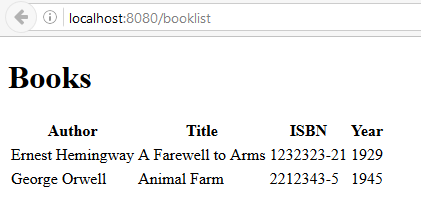
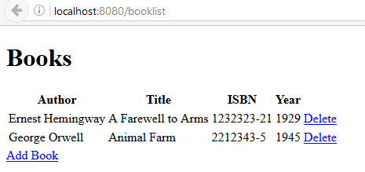
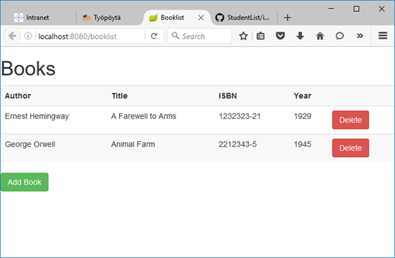

# Chapter 3

Use your own bookstore application from the GitHub.

## Bookstore: Add JPA and database

1. Add JPA support and H2 database to your bookstore project by modifying pom.xml file.
2. Create an entity from your Book class
3. Check again that you DO NOT have attribute year – it is a reserved word – make it for example publicationYear
4. Add command line runner to insert few example data to your database
5. Modify properties to show SQL statements in the console
6. Enable H2 console

You should see similar messages in the console after you run your application


Push all changes to GitHub.

## Bookstore: Listpage

Create a template called booklist.html which shows all books from the database in html table. To show the books you have to add new method to controller that handle GET request from endpoint like /booklist.



Push all changes to GitHub.

## Bookstore: Crud

Add Create and Delete functionalities to your Bookstore application

For create functionality add new thymeleaf template called addbook.html

For deletion use *@PathVariable* annotation.



Push all changes to GitHub.

## Edit Bookstore

Add edit functionality to your bookstore. Create edit link after delete link to your listpage. Edit link will open current book in the edit page.

Tip. Check ‘Add book’-functionality from the controller. In add functionality you added new book object to model but now you will add current book object to model. You also have to send current book id from the list page to controller (like you did in delete link).

Push all changes to GitHub.

## Bookstore: A Little bit Front-end (Extra)

1. Add Bootstrap to your bookstore application. Download *bootstrap.min.css* from the bootstrap site. Copy it to your projects resources\static\css folder (Create the folder if it does not exist). Add link to your booklist template file.

```
<link type=**"text/css"** rel=**"stylesheet"** href=**"/css/bootstrap.min.css"** th:href=**"@{/css/bootstrap.min.css}"** />
```

1. Add ***class="table table-striped"*** to your table html element
2. Add ***class="btn btn-success"*** to your ‘Add Book’- button html element
3. Add ***class="btn btn-danger"*** to your ‘Delete’- button html element



Push all changes to GitHub.
