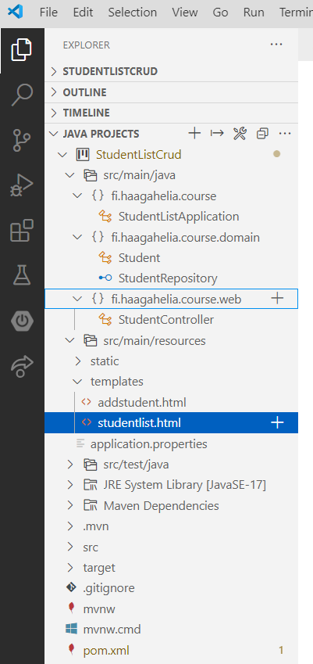

<!-- Slide number: 1 -->
# Back End Programming: ORM/JPA, Databases
Minna Pellikka, Juha Hinkula and Jukka Juslin

<!-- Slide number: 2 -->
# Spring Boot: JPA

- JPA (Java Persistence API) is a collection of classes to persistently store data into a database
- JPA provides object – relational mapping for managing relational data in JAVA applications (ORM)
- There is lot of implementations of the JPA (like Hibernate)
- Dependency

```xml
<dependency>
	<groupId>org.springframework.boot</groupId>
	<artifactId>spring-boot-starter-data-jpa</artifactId>
</dependency>
```

<!-- Slide number: 3 -->
# Architecture of this lesson setup


<!-- Slide number: 4 -->
# H2 Database
- H2 is open source Java based SQL database
- www.h2database.com
- Embedded and server modes: in-memory databases
- Good database for prototyping, testing etc.
- Dependency

```xml
<dependency>
	<groupId>com.h2database</groupId>
	<artifactId>h2</artifactId>
</dependency>
```

<!-- Slide number: 5 -->
# H2 Database Console
- H2 provides a web based console
- Add following lines to the `application.properties` file

```
spring.h2.console.enabled=true
spring.h2.console.path=/h2-console
spring.datasource.url=jdbc:h2:mem:testdb
```

- Navigate to `localhost:8080/h2-console`
	- JDBC URL = `jdbc:h2:mem:testdb`
	- Leave password field empty


<!-- Slide number: 6 -->
# Logging of SQL Statements

- You can add following property to `application.properties` file. This enables the logging of SQL statements.

```
spring.jpa.show-sql=true
```

<!-- Slide number: 7 -->
# Entity
- An entity represents a table in relational database
- Entity class must be annotated with `@Entity` annotation (jakarta.persistence.Entity)
- By default, the table name is the name of the entity class. It can be changed by using `@Table` annotation

```java
import jakarta.persistence.Entity;

@Entity
public class Student {
	// More code..
```

<!-- Slide number: 8 -->
# Entity and @Id Annotation
- `@Id` annotation is used for creating id column of the table
- `@GeneratedValue` annotation generates automatically a unique primary key for every new entity object (GenerationType.Auto)

```java
@Id
@GeneratedValue(strategy = GenerationType.AUTO)
private Long id;
```

<!-- Slide number: 9 -->
# Entity and @Column Annotation
- The other properties can be left unannotated. Then these properites are mapped to columns that share the same name as properties itself
- `@Column` annotation can be used to specify mapped column. Example: `@Column(name=”address”)`

```java
@Id
@GeneratedValue(strategy = GenerationType.AUTO)
private Long id;
private String firstName, lastName, email;
…getters and setters
```

<!-- Slide number: 10 -->
# Example Entity: Student

```java
@Entity
public class Student {
	@Id
	@GeneratedValue(strategy=GenerationType.AUTO)
	private Long id;
	private String firstName, lastName, email;
	
	public Student() {}
	
	public Student(String firstName, String lastName, String email) {
		this.firstName = firstName;
		this.lastName = lastName;
		this.email = email;
	}
	
	@Override
	public String toString() {
		return "Student id=" + id + ", firstName=" + firstName + ",lastName=" + lastName;
	}
}
```

<!-- Slide number: 11 -->
# Wanted Directory Structure



<!-- Slide number: 12 -->
# CrudRepository
- The `CrudRepository` provides CRUD functionality for the entity class that is being managed.
- How to use repositories:

1. Declare an interface extending CrudRepository
2. Declare query methods on the interface
3. Get the repository instance injected and use it

<!-- Slide number: 13 -->
# New Interface Extending CrudRepository
1. **Declare an interface extending CrudRepository** (Create a new class which extends CrudRepository)

By extending CrudRepository the StudentRepository inherits  methods for working with Student persistence, including methods for saving, deleting, and finding Student entities.

```java
import org.springframework.data.repository.CrudRepository;

public interface StudentRepository extends CrudRepository<Student, Long> {
	...
}
```

<!-- Slide number: 14 -->
# New Query Methods on the Interface
2. **Declare query methods on the interface**

Note! In typical Java application you should write an class that implements StudentRepository. Spring Data JPA creates this automatically when you run the application.

```java
import java.util.List;

import org.springframework.data.repository.CrudRepository;

public interface StudentRepository extends CrudRepository<Student, Long> {
	List<Student> findByLastName(String lastName);
}
```

<!-- Slide number: 15 -->
3. **Get the repository instance injected and use it**

Constructor Injection annotation bring repository class into the context, and will inject an instance of the service into the YourAppClass class. Works only if there is only one constructor! Otherwise you need to use @Autowired annotation

```java
@Controller
public class StudentController {
	private StudentRepository repository;
	// constructor injection. Can only be one constructor then.
	public StudentController(StudentRepository repository) {
		this.repository = repository;
	}

	@RequestMapping(value= {"/", "/studentlist"})
	public String studentList(Model model) {
		model.addAttribute("students", repository.findAll());
		return "studentlist";
	}
}
```

<!-- Slide number: 16 -->
# Some Useful Methods of CrudRepository

|  |  |
| --- | --- |
| `long count()` | Returns the number of entities available. |
| `void deleteById(ID id)` | Deletes the entity with the given id |
| `void delete(T Entity)` | Deletes given entity |
| `deleteAll()` | Deletes all entities managed by the repository |
| `Iterable<T> findAll()` | Returns all entities |
| `Optional<T> findById(ID id)` | Retrieves an entity by its id |
| `<S extends T> S save(S entity)` | Saves a given entity |

<!-- Slide number: 17 -->
# Spring Boot: CommandLineRunner

- If you need to run some specific code when the SpringApplication has started, you can implement the `CommandLineRunner` interfaces. This is good place to add some demo data to your apllication

```java
@Bean
public CommandLineRunner demo(StudentRepository repository) {
	return (args) -> {
	  // Your code...add some demo data to db
	};
}
```

<!-- Slide number: 18 -->
# Thymeleaf Template: studentlist.html

- Adding List page to a Spring Boot application

1. Create template for list page (studentlist.html).

```html
<table class="table table-striped">
  <tr>
   <th>Name</th>
   <th>Email</th>
  </tr>
     <tr th:each = "student : ${students}">
       <td th:text="${student.firstName} + ' ' + ${student.lastName}"></td>
       <td th:text="${student.email}"></td>
     </tr>
</table>
```

<!-- Slide number: 19 -->
# Controller Method and Fetching Data from the Database
2. Create method to your controller. All students are fetched from the database and added to the model attribute.

```java
@Autowired
private StudentRepository repository;

…

@RequestMapping(value="/studentlist")
public String studentList(Model model) {
  model.addAttribute("students", repository.findAll());
  return "studentlist";
}
```

<!-- Slide number: 20 -->
# Thymeleaf Template: addstudent.html
- Adding Create funtionality to a Spring Boot application
1. Create template for adding new entity (in this example addstudent.html). Download source code from the course site.

```html
<h1>Add student</h1>
<div>
<form th:object="${student}" th:action="@{save}" action="#" method="post">
	<label for="fname">Firstname</label>
	<input type="text" id="fname" th:field="*{firstName}" />
	<label for="lname">Lastname</label>
	<input type="text" id="lname" th:field="*{lastName}" />
	<label for="email">Email</label>
	<input type="text" th:field="*{email}" />
	<input type="submit" value="Save"></input>
</form>
</div>
```

<!-- Slide number: 21 -->
# Create Functionality
2. Create functionality to your controller

```java
@RequestMapping(value = "/add")
public String addStudent(Model model){
    model.addAttribute("student", new Student());
    return "addstudent";
}

@RequestMapping(value = "/save", method = RequestMethod.POST)
public String save(Student student){
     repository.save(student);
     return "redirect:studentlist";
}
```

3. Add link to create functionality
```html
 <a href="/add" class="btn btn-primary">Add Student</a>
```

<!-- Slide number: 22 -->


<!-- Slide number: 23 -->
# Delete functionality
- Adding Delete functionality to a Spring Boot application

1. Create functionality to the controller

```java
@RequestMapping(value = "/delete/{id}", method = RequestMethod.GET)
public String deleteStudent(@PathVariable("id") Long studentId, Model model) {
	repository.deleteById(studentId);
	return "redirect:../studentlist";
}
```

- deleteStudent method listens `/delete/studentid` endpoint
- By using `@PathVariable` annotation Spring extracts id from the URI
- For example, request `http://localhost:8080/delete/5`, the `@PathVariable` studentId will be 5.

<!-- Slide number: 24 -->
# Delete Link
2. Add link to delete functionality (for example in the listpage row)

```html
<a th:href="@{/delete/{id}(id=${student.id})}">Delete</a>
```

<!-- Slide number: 25 -->
# CrudRepository and New Queries

- Query methods: CrudRepository can derive the query from the method name
- Examples:

```java
public interface StudentRepository extends CrudRepository<Student, Long> {
	List<Student> findByLastName(String lastName);
	
	List<Student> findByFirstNameAndLastName(String firstName, String lastName);
	
	// Enabling ignoring case
	List<Student> findByLastNameIgnoreCase(String lastName);
	
	// Enabling ORDER BY for a query
	List<Student> findByLastNameOrderByFirstNameAsc(String lastName);
}
```

<!-- Slide number: 26 -->
# Relationships with JPA
- One-to-Many
	- `@OneToMany` and `@ManyToOne` annotations defines a one-to-many and many-to-one relationship between two entities
	- `@JoinColumn` annotation defines the owner of the relationship (Table has a column with a foreign key to the referenced table)

<!-- Slide number: 27 -->
# One-to-Many Relationship with JPA


<!-- Slide number: 28 -->
# Student Entity and @ManytoOne Relationship to Department
	- Add new department attribute with `@ManyToOne` and `@JoinColumn` annotations

```java
@ManyToOne
@JoinColumn(name = "departmentid")
private Department department;
```
 
- Add getters and setters for department
- Add department to constructor

<!-- Slide number: 29 -->
# Department Entity and @OnetoMany Relationship to Students
	- Add new students attribute with `@OneToMany` annotation

```java
@OneToMany(cascade = CascadeType.ALL,mappedBy = "department”)
private List<Student> students;
```

- Add getters and setters

<!-- Slide number: 30 -->
# DepartmentRepository
- Add CrudRepository for Department entity

```java
import org.springframework.data.repository.CrudRepository;

public interface DepartmentRepository extends CrudRepository<Department, Long> {
	...
}
```

<!-- Slide number: 31 -->
# Student Form and Department Dropdown List 1/2
- Add department dropdown list to student form
	- You have to add new model attribute to controller method which shows student creation form. You also have to inject department repository to controller

```java
@Autowired
private StudentRepository repository;
@Autowired
private DepartmentRepository drepository;

// Add new student
@RequestMapping(value = "/add")
public String addStudent(Model model){
	model.addAttribute("student", new Student());
	model.addAttribute("departments", drepository.findAll());
	return "addstudent";
}
```

<!-- Slide number: 32 -->
# Student Form and Department Dropdown List 2/2
- Add department dropdown list to student form
	- Departments can be now get from the model attribute in the template (departments attribute)
	- Select element shows department names (th:text) but the value will be departmentid (th:value)

```html
<label for="deplist">Department</label>
<select id="deplist" th:field="*{department}" class="form-control">
	<option th:each="department: ${departments}"
		th:value="${department.departmentid}"
		th:text="${department.name}"></option>
</select>
```
<!-- Slide number: 33 -->
# Student List with Names of Departments
- Show department name in the studentlist

```html
<tr th:each = "student : ${students}">
	<td th:text="${student.firstName} + ' ' + ${student.lastName}"></td>
	<td th:text="${student.email}"></td>
	<td th:text="${student.department.name}"></td>
	<td><a th:href="@{/delete/{id}(id=${student.id})}">Delete</a></td>
</tr>
```

<!-- Slide number: 34 -->
|||
|-|-|

<!-- Slide number: 35 -->
# Edit functionality
	- Similar to Add functionality of Student Application
	- Model contains now edited object instead of empty object (in the case of add)

```java
// Edit student
@RequestMapping(value = "/edit/{id}")
public String showModStu(@PathVariable("id") Long studentId, Model model){
	model.addAttribute("student", repository.findById(studentId);
	model.addAttribute("departments", drepository.findAll());
	return ”editstudent";
}
```

<!-- Slide number: 36 -->
# Thymeleaf Template: modifystudent.html
- In thymeleaf need to be careful of proper syntax. For example modifystudent.html:

```html
</html>
	<body>
		<h1>Modify student</h1>
		<div>
			<form th:object="${student}" th:action="@{../save}" action="#" method="post">
			<label for="id"></label>
			<input type="hidden" id="id" th:field="*{id}" readonly="readonly" />
			<div style="clear: both; display: block; height: 10px;"></div>
			<label for="studentNumber">Student number</label>
			<input type="text" id="author" th:field="*{studentNumber}" />
			<label for="catlist">Category</label>
			<select id="catlist" th:field="*{category.categoryid}" class="form-control">
			<option th:each="cat: ${categories}" th:value="${cat.categoryid}" th:text="${cat.name}"></option>
			</select>
			<div style="clear: both; display: block; height: 10px;"></div>
			<input class="btn btn-success" type="submit" value="Save"></input>
			</form>
		</div>
	</body>
</html>
```

<!-- Slide number: 37 -->
- Edit functionality
	- Template for editing
	- Note! Id should be added otherwise new student is created

```html
<form th:object="${student}" th:action="@{../save}" action="#" method="post">
	<input type="hidden" th:field="*{id}" class="form-control"/>
	<input type="text" th:field="*{firstName}" />
	<input type="text" th:field="*{lastName}" />
	<input type="text" th:field="*{email}" />
	<input type="submit" class="btn btn-success" value="Save"></input>
</form>
```

<!-- Slide number: 38 -->
# Spring Boot: MySQL/MariaDB
- Switching database from H2 to MySQL/MariaDB

1. Remove H2 dependency from the pom.xml file
2. Add MySQL/MariaDB dependency to the pom.xml file

```xml
<dependency>
	<groupId>mysql</groupId>
	<artifactId>mysql-connector-java</artifactId>
	<version>8.0.33</version>
</dependency>
```

- Add following database connection settings to the `application.properties` file:

```
spring.datasource.driver-class-name=com.mysql.cj.jdbc.Driver
spring.datasource.url=jdbc:mysql://localhost:3306/jusju?useUnicode=true&useJDBCCompliantTimezoneShift=true&useLegacyDatetimeCode=false&serverTimezone=UTC
spring.datasource.username=jusju
spring.datasource.password=YOUR_PASSWORD
spring.datasource.initialization-mode=always
spring.batch.initialize-schema=always
```

<!-- Slide number: 39 -->
# Switching Database from H2 to MariaDB
- For testing purposes you can install MariaDB locally and use `localhost` as server address. Change also password in the `application.properties` file (Password that you defined when installing MySQL/MariaDB).
- Use HeidiSQL to create new database before running the application (see the next slide)
- Set `DB_NAME` in the `application.properties` file to match name of the database you just created.
- Run the application and check with HeidiSQL that database tables were created.

<!-- Slide number: 40 -->

