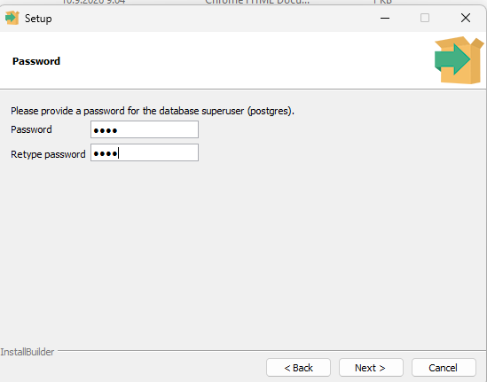
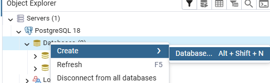

<!-- Slide number: 1 -->

# Back End Programming: Using Postgre Database

Minna Pellikka

This document explains how to replace the runtime (in-memory-database) H2 database with an external database.

<!-- Slide number: 2 -->

## Install PostgreSQL & create databases and tables

1. Install PostgreSQL on your own machine if you don't already have have it installed. Link is htps://www.postgresql.org/download/

   PostgreSQL installation instructions can be found, for example,
   htps://www.w3schools.com/postgresql/postgresql_install.php
   (There is no need to install Stackbuilder)
   or
   https://www.enterprisedb.com/docs/supported-open-source/postgresql/installing/

   Save the password you entered during the installation – you'll need it later.
   

3. Start the pgAdmin application (htps://www.pgadmin.org/docs/)

4. Create a new database by hovering over the Databases symbol under PostgreSQL and right-clicking on it. Select Create > Database from the menu
   

5. Give your Database a name and click Save

6. Create "SQL script" for your Backend project. The script should contain the SQL statements for creating the tables. Save the database script either in the root of your project or in the resources folder.

7. You can run the script with the following steps: a) select Schemas > Tables. b) On top of Tables, select PSQL Tool from the pop-up menu c) copy to the PSQL editor SQL commands from the database

8. Now you have a PostgreSQL database on your own machine. Next, configure the Spring Boot application so that it uses PostgreSQL database instead of H2.

## Configure Spring Boot application:

1. Open the application.properties. Define the connection URL, username, and password for the database you created.
It would be better to parameterize the URL, username, and password instead of storing the credentials directly in version control. For now, however, you can put them directly in the configuration file. Below is an example. Update the values highlighted in yellow according to the settings of your own database.

2. Add the required PostgreSQL dependency to POM.XML.

3. Comment out the test data creation in the main application class.

4. Check that the names of the entity classes match the names of the database tables. Remember that PostgreSQL is case-sensitive in certain contexts. If you notice a difference between the entity and table names, correct it using the @Table annotation.

Also check that the entity column names match the database column names.

5. Start your Backend application and test the functionality.

6. If the application works correctly, commit the changes to version control. Note that you may want to use separate Git branches for the H2 and PostgreSQL versions. (Commit also the database SQL script to Git.)

