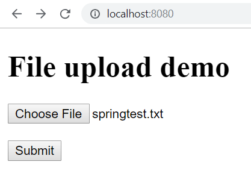
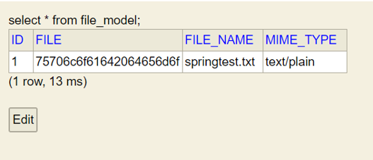
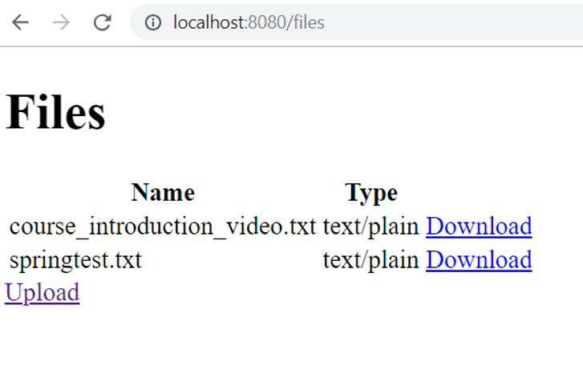

<!-- Slide number: 1 -->
# Server Programming: File upload
Juha Hinkula

<!-- Slide number: 2 -->
# Spring Boot – File upload

- Add new controller for file uploading

```java
@Controller
public class FileController {
}
```

- Add method into controller that maps ’/’ – endpoint to upload.html thymeleaf template (GET method)

```java
@GetMapping("/")
public String index() {
	return "upload";
}
```

<!-- Slide number: 3 -->
- Add `upload.html` thymeleaf template to resources/templates folder
- `enctype` defines how data is encoded when sending to server. Use `multipart/form-data` in the case of file upload.
- Form is posted to `/upload` endpoint

```html
<!DOCTYPE html>
<html xmlns:th="http://www.thymeleaf.org">
	<body>
	<h1>File upload demo</h1>
		<form method="POST" action="/upload" enctype="multipart/form-data">
			<input type="file" name="file" /><br/>
			<input type="submit" value="Submit" />
		</form>
	</body>
</html>
```

<!-- Slide number: 4 -->
- Add method into controller for `/upload` endpoint (POST from the upload.html)
- File can be accessed using `RequestParam` with id ’file’ (Name of the file input field in upload.html is file)
- Spring `MultipartFile` can be used to temporarily store uploaded file.

```java
@PostMapping("/upload")
public String fileUpload(@RequestParam("file") MultipartFile file, Model model) {
	// File handling
}
```

<!-- Slide number: 5 -->
- Check if the file is empty (no file has been chosen in upload form or file has no content) in `fileUpload` method. If it is empty move to `uploadstatus` thymeleaf template and add message to model attribute.

```java 
// In fileUpload method
if (file.isEmpty()) {
	model.addAttribute("msg", "Upload failed");
	return "uploadstatus";
}
```

<!-- Slide number: 6 -->
- After empty file check we will add file handling that save uploaded file to upload folder.
- Upload folder can be specified using `application.properties` file
- Add following line to the `application.properties` file

```
upload.path=c:\\temp\\
```

- You can read `application.properties` values using `@Value(${propertyName})` annotation. Add following line at the beginning of your controller. It reads `upload.path` value from the `application.properties` file and save it to `uploadFolder` variable.

```java
@Value("${upload.path}")
private String uploadFolder;
```

<!-- Slide number: 7 -->
```java
// Note! Imports
import java.io.IOException;
import java.nio.file.Files;
import java.nio.file.Path;
import java.nio.file.Paths;
```

- Add following file handling code after the empty file check in your controller. That save uploaded file to the upload folder defined in  application.properties file.

```java
try {
	byte[] bytes = file.getBytes();
	Path path = Paths.get(uploadFolder + file.getOriginalFilename());
	Files.write(path, bytes);
	model.addAttribute("msg", "File " + file.getOriginalFilename() + " uploaded");
} catch (IOException e) {
	e.printStackTrace();
}
return "uploadstatus";
```

<!-- Slide number: 8 -->
- Whole `fileUpload` method

```java
@PostMapping("/upload")
public String fileUpload(@RequestParam("file") MultipartFile file, Model model) {
	if (file.isEmpty()) {
		model.addAttribute("msg", "Upload failed");
		return "uploadstatus";
	}
	try {
		byte[] bytes = file.getBytes();
		Path path = Paths.get(uploadFolder + file.getOriginalFilename());
		Files.write(path, bytes);
		model.addAttribute("msg","File "+file.getOriginalFilename()+" uploaded");
	} catch (IOException e) {
		e.printStackTrace();
	}
	return "uploadstatus";
}
```

<!-- Slide number: 9 -->
- Finally we will implement `uploadstatus.html` thymeleaf template that show the status of upload.

```html
<!DOCTYPE html>
<html xmlns:th="http://www.thymeleaf.org">
	<body>
		<h3 th:text="${msg}" />
	</body>
</html>
```

<!-- Slide number: 10 -->
- We also have to enable multipart file upload. Add following line to the `application.properties` file

```
spring.servlet.multipart.enabled=true
```

- Default max file size in Spring is 1MB. You can change this value with following settings in the application.properties file

```
spring.servlet.multipart.max-file-size=10MB
spring.servlet.multipart.max-request-size=10MB
```

<!-- Slide number: 11 -->
- The whole source code can be found from course demos github (Filedemo)

https://github.com/juhahinkula/ServerProgramming.git

<!-- Slide number: 12 -->
- How to save uploaded files to database?
- Add database & JPA dependencies
- Create model class for files. File content is saved to LOB (Large object) field.

```java
@Entity
public class FileModel {
@Id
@GeneratedValue(strategy = GenerationType.AUTO)
private long id;
private String fileName, mimeType;

@Lob
private byte[] file;
// ...constructors, getters, setters
```

<!-- Slide number: 13 -->
- Create repository class for file model class

```java
public interface FileModelRepository extends CrudRepository<FileModel, Long> {
}
```

<!-- Slide number: 14 -->
- In the file controller, create new FileModel entity and save it to a database.

```java
try {
	byte[] bytes = file.getBytes();
	FileModel fileModel = new FileModel(file.getOriginalFilename(), 	file.getContentType(), bytes);
	repository.save(fileModel);
	model.addAttribute("msg", "File " + file.getOriginalFilename() + " uploaded");
} catch (IOException e) {
	e.printStackTrace();
}
```

<!-- Slide number: 15 -->
|||
|-|-|

<!-- Slide number: 16 -->
**How to list uploaded files and add download functionality?**

- Add method to controller for fetching all files.

```java
@GetMapping("/files")
public String fileList(Model model) {
	model.addAttribute("files", repository.findAll());
	return "filelist";
}
```

<!-- Slide number: 17 -->
- Add `filelist.html` thymeleaf template to show files

```html
<body>
	<h1>Files</h1>
	<table>
		<tr>
			<th>Name</th>
			<th>Type</th>
		</tr>
		<tr th:each = "file : ${files}">
			<td th:text="${file.fileName}"></td>
			<td th:text="${file.mimeType}"></td>
		</tr>
	</table>
	<a href="/">Upload</a>
</body>
```

<!-- Slide number: 18 -->
- Add method to controller for file download. Spring `ResponseEntity` represents HTTP request or response. File content is added to the body of response. Content-Disposition header indicates that response contains attachment.

```java
@GetMapping("/file/{id}")
public ResponseEntity<byte[]> getFile(@PathVariable Long id) {
	Optional<FileModel> fileOptional = repository.findById(id);
	
	if(fileOptional.isPresent()) {
		FileModel file = fileOptional.get();
		return ResponseEntity.ok()
			.header(HttpHeaders.CONTENT_DISPOSITION, "attachment; filename=\""
			+ file.getFileName() + "\"")
			.body(file.getFile());
	}
	return ResponseEntity.status(404).body(null);
}
```

<!-- Slide number: 19 -->
- Add download link to filelist

```html
<body>
	<h1>Files</h1>
	<table>
		<tr>
			<th>Name</th>
			<th>Type</th>
		</tr>
		<tr th:each = "file : ${files}">
			<td th:text="${file.fileName}"></td>
			<td th:text="${file.mimeType}"></td>
			<td><a th:href="@{/file/{id}(id=${file.id})}">Download</a></td>
		</tr>
	</table>
	<a href="/">Upload</a>
</body>
```

<!-- Slide number: 20 -->


<!-- Slide number: 21 -->
- The whole source code can be found from course demos github (FiledemoDb)

https://github.com/juhahinkula/ServerProgramming.git
