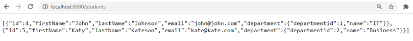

<!-- Slide number: 1 -->
# Back End Programming: REST

<!-- Slide number: 2 -->
# Spring Boot: REST

- REST (Representational State Transfer)
- REST is an architectural style for designing distributed systems. It is not a standard but a set of constraints
- Main principles
	- Resources expose easily understood directory structure URIs
	- Representations transfer JSON or XML to represent data objects and attributes
	- Messages use HTTP methods (POST, GET, PUT, DELETE)
		- PUT to modify and POST to add new
	- Stateless interactions store no client context on the server between requests

<!-- Slide number: 3 -->
# REST Endpoints

| Http Method | Resource Endpoint | Actions |
| --- | --- | --- |
| GET | /students | Get All Students |
| POST | /students | Add New Student |
| GET | /students/{id} | Get One Student |
| PUT | /students/{id} | Update One Student |
| DELETE | /students/{id} | Delete One Student |
| Etc. |  |  |

<!-- Slide number: 4 -->
# REST Controller
- In Spring framework’s approach to building RESTful web services, HTTP requests are handled by a controller
- Controllers are identified by `@RestController` annotation
- Difference between REST and MVC controller are that REST controller returns HTTP response body and MVC controller returns a view.
- REST controller will write object data to the HTTP response as JSON format
- Spring uses Jackson JSON processor to convert object data to JSON

<!-- Slide number: 5 -->
# Example of REST Controller
- In the following example you have Message class with two attributes (id, text)

```java
@RestController
public class MessageController {
	private final AtomicLong counter = new AtomicLong();

	@RequestMapping("/hello")
	public Message greeting(@RequestParam(value="name", defaultValue="World") String name) {
		return new Message(counter.incrementAndGet(),"Hello " + name);
	}
}
```

<!-- Slide number: 6 -->
# REST Request and JSON Data

1. First GET request with request parameter


2. Second GET request without request parameter


<!-- Slide number: 7 -->
# REST Controller and @ResponseBody Annotation
- You can also create RESTful service by using `@Controller` and `@ResponseBody` annotations

```java
@Controller
public class MessageController {
	private final AtomicLong counter = new AtomicLong();
	
	@RequestMapping("/hello")
	public @ResponseBody Message greeting(@RequestParam(value="name", defaultValue="World") String name) {
		return new Message(counter.incrementAndGet(),"Hello " + name);
	}
}
```

<!-- Slide number: 8 -->
# MVC Controller versus REST Controller
- Example: Add REST service to student list application (Example project from ORM One-to-many chapter)
	- The first method returns students to Thymeleaf template. The second method returns as JSON format.

```java
// Show all students in Thymeleaf template
@RequestMapping(value="/studentlist", method = RequestMethod.GET)
public String studentList(Model model) {
	model.addAttribute("students", repository.findAll());
	return "studentlist"; // studentlist.html
}

// RESTful service to get all students
@RequestMapping(value="/students", method = RequestMethod.GET)
public @ResponseBody List<Student> studentListRest() {
	return (List<Student>) repository.findAll();
}
```

<!-- Slide number: 9 -->
# @JsonIgnore and @JsonIgnoreProperties Annotations
- You have to configure one-to-many relationship from JSON by using `@JsonIgnore` or `@JsonIgnoreProperties` annotation. Otherwise entity relationship will cause endless loop (First student is serialized and it contains department which is then serialized which contains students which are then serialized….)
- Next slide has the usage for this relationship

```java
@ManyToOne
@JoinColumn(name = "departmentid")
private Department department;
```

<!-- Slide number: 10 -->
- Department class has

```java
@JsonIgnoreProperties("department")
// ignoring ’department’ attribute for all students
@OneToMany(cascade = CascadeType.ALL, mappedBy = "department")
	private List<Student> students;
```

<!-- Slide number: 11 -->
# Endpoints: /students versus /studentlist
- Now /students endpoint will return students in JSON



- And /studentlist endpoint will return HTML page


<!-- Slide number: 12 -->
# Endpoint /students/{id}
- RESTful service to find student by id using path variable

```java
// RESTful service to get on student by id
@RequestMapping(value="/students/{id}", method = RequestMethod.GET)
public @ResponseBody Student findStudentRest(@PathVariable("id") Long studentId)
	return repository.findById(studentId);
}
```


<!-- Slide number: 13 -->
# Spring Data REST
- Spring Data REST builds on top of Spring Data repositories and automatically exports those as REST resources
- Add dependency to get started with Spring Data REST

```xml
<dependency>
	<groupId>org.springframework.boot</groupId>
	<artifactId>spring-boot-starter-data-rest</artifactId>
</dependency>
```

<!-- Slide number: 14 -->
# Base Path of Spring Data REST
- Spring Data REST detects public repositories to determine if a repository will be exported as REST resource
- You don't need to define any Controller
- By default Spring Data REST serves REST resources in application root path ’/’.
- Path can be changed in appliction.properties file

```
spring.data.rest.base-path=/api
```

<!-- Slide number: 15 -->
# StudentRepository and Spring Data REST
- If you have the following repository

```java
public interface StudentRepository extends CrudRepository<Student, Long> { }
```

- Spring Data REST will create REST service `/students`
- Example: `http://localhost:8080/api/students`
- The service path name is derived from the entity name (pluralized and uncapitalized)
- Spring Data REST services contains also links to resources (using HAL format)

<!-- Slide number: 16 -->
# Resources of Spring Data REST
- All available REST resources can be found with HTTP GET request to application root URL
- Example: Student application


<!-- Slide number: 17 -->
# Departments REST Service with HAL format


<!-- Slide number: 18 -->
# Spring Data REST Endpoint /api/students and POST Request
<!-- No idea what below curl command snippet is for in materials -->
<!-- curl -H "Content-Type: application/json" -X POST -d {\"username\":\"mkyong\",\"password\":\"abc\"} http://localhost:8080/api/login/ -->

- Services can be also used to add and delete items
- Example:
	- Following POST request will add new student to database

```shell
curl -H "Content-Type: application/json" -X POST -d '{"firstName":"Jukka","lastName":"Juslin"}' http://localhost:8080/api/students
```

REST services can be also secured by using Spring Security (next lessons)

<!-- Slide number: 19 -->
# @RepositoryRestResource Annotation
- You can also use your queries from the `CrudRepository` by using Rest API
- Example

```java
@RepositoryRestResource
public interface StudentRepository extends CrudRepository<Student, Long> {
	List<Student> findByEmail(@Param("email") String email);
}
```

- Add `@RepositoryRestResource` annotation to your repository class and `@Param` annotation for your parameters
- Now you can call your query by using following endpoint

```
http://localhost:8080/api/students/search/findByEmail?email=johnson@mail.com
```

<!-- Slide number: 20 -->
# JSON Format for Data REST Request (POST)

- To add new student

```json
{
	"firstName": "Jukka",
	"lastName": "Kateson",
	"email": "kate@kate.com",
	"department": "api/departments/1"
}
```

<!-- Slide number: 21 -->
# Example Data REST Requests (PUT, DELETE) with Curl

```shell
$ curl -X PUT http://localhost:8080/api/students/6 -H 'Content-type:application/json' -d '{"firstName": "Samwise Gamgee", "lastName": "ring bearer"}'

$ curl -X DELETE http://localhost:8080/api/students/7
```
