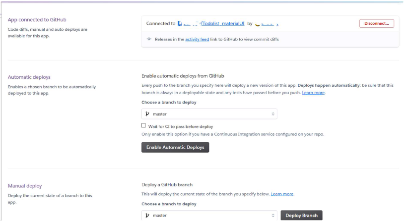

Heroku Deployment Instructions with PostgeSQL

1.  Create a Spring Boot project in your Eclipse or use as a test in course demo - for example "**SecureStudentListUser**" should do, because it has at least both the database and Spring Security, which is a minimum software should have. That software needs to be modified though from `application.properties` to match needs of a real **Postgre** database.

2.  Make sure your project is in github from its root level, meaning that when you open a given repository you see for example pom.xml on the root level:


You can put your project to github using git bash program, if you go with **cd** (change directory) command to the root level of a specific project. Then you would issue following commands, and after these commands, you would find the project in github.

```
git init
git add .
git commit -m “first commit”
git remote add origin https://github.com/USERNAME/REPONAME.git
git push
```

3.  Open Heroku and get an account in Heroku if you do not have one.
(https://www.heroku.com/)

After signed in you should see a screen something like the following. Commercial services change their layout all the time so this picture will not be updated. Essential is to find a button, that says something like “Create a new app”.


4.  Create an app in Heroku (https://dashboard.heroku.com/new-app)

After clicked on “Create new app”, then you find the following dialog. Simple fill the form by giving a name to your app, and choosing a region (US or Europe). Press the button “Create app” and continue.


Please note that, you would get tips of naming - lowercase letters, dash, digits are allowed. Try and get a satisfied name for your app.

5.  Deployment methods in Heroku.

After you’ve created an app in Heroku, you will be guided to deployment page. Heroku has their own git system, but the most direct way is probably to connect to your git repository on Github by clicking on “***GitHub - connect to Github***”.


6.  Connect to GitHub repository

Once you are connected to GitHub, a dialog of search for a repository from your Github repositories. Click on “Search”, all the available repositories are displayed, and press “Connect” for the one you’d like to deploy on Heroku.


7.  App deployment

As you can see your Github repository is connected to the app, now you have two options:

a). “*Enable automatic deploys from Github*”; b). “*Manualy deploy a Github branch*”.



Note that, the automatic deployment will update your app on Heroku for every push you made to github, say it the newest version. If this is the case, you’d press “Enable Automatic Deploys”.

Otherwise, go “Manual deploy”, to “Deploy a Github branch” , so that you get the build dialog after pressing “Deploy Branch”. The latest git commit is shown in “Build master”.


8.  Deployment succeeds

In case everything went well, you would get all greens for build and release. Finally a url is provided to run the deployed app. Click on “View”.


9.  Activity log and Build log

Not every time we get successful stories. In case of failure, It is quite useful to check on Activity log and Build log. The activity log is under the main menu of personal app. Click on “view build log”, you see details of compiling, building, packaging and exceptions.


- During Heroku usage you probably need to use Heroku cli. Install Heroku cli and use it from Windows command prompt, not git bash. **cli** means command line interface

- First do command:
`heroku login`


- Login to the system and after that you can see for example logs with this command. Test it, though you probably will not see anything on first use. You might have to repeat command two times. The point is to test and see if you can see error.

`heroku logs --app jukka-bookstore --tail`

**Replace** *jukka-bookstrore* with **your application name**.

- Add to your **pom.xml**:

```java
<dependency>
   <groupId>org.postgresql</groupId>
   <artifactId>postgresql</artifactId>
</dependency>
```

- Remove H2 dependency from your pom.xml

- Go to **Resources** in your Heroku application view.


- Type to **Add-ons field**: `Heroku Postgres`


- Select Free plan.

- Click on **Heroku Postgres**.


- Go to **Settings** -> **View Credentials**.


- Copy credentials from that screen to your `application.properties` to format given here. **Change credentials to be your credentials.**

```
#spring.h2.console.enabled=true
#spring.h2.console.path=/h2-console
#spring.datasource.url=jdbc:h2:mem:testdb
logging.level.org.hibernate.type.descriptor.sql.BasicBinder=trace
spring.data.rest.basePath=/api

spring.jpa.show-sql=true
#spring.datasource.url=jdbc:h2:mem:testdb
#spring.h2.console.enabled=true
#spring.h2.console.path=/h2-console
spring.jpa.open-in-view=true
spring.datasource.driver-class-name=org.postgresql.Driver

server.port=8080
spring.jpa.database=POSTGRESQL
spring.datasource.platform=postgres
# possible values for hibernate.ddl-auto are create-drop, validate, none and update

spring.datasource.url=jdbc:postgresql://xxx-xx-xx-xx-xx.eu-west-1.compute.amazonaws.com:5432/xxxxxxxxxxxxxx?sslmode=require
spring.datasource.username=CHANGE ME
spring.datasource.password=CHANGE ME

spring.jpa.show-sql=true
#spring.jpa.generate-ddl=true
spring.jpa.hibernate.ddl-auto=update
spring.datasource.initialization-mode=always

spring.jpa.properties.hibernate.jdbc.lob.non_contextual_creation=true
```

`#spring.datasource.url=${SPRING_DATASOURCE_URL}`

`#spring.datasource.username=${SPRING_DATASOURCE_USERNAME}`

`#spring.datasource.password=${SPRING_DATASOURCE_PASSWORD}`

Note **#** hashtag is mark for comment.

Usernames are UNIQUE, so you must deleteAll in Heroku.

Default success url better to have two mappings at controller.

If you have **User named entity, it conflicts with PostgreSQL user reserved work so
rename your user to something else. For example fix like this:**

```java
@Entity

@Table(name="usertable")

public class User {
```

**For security reasons try not to publish to github your credentials:**

<mark>Once the database add-on has been created, Heroku will automatically populate the environment variables</mark>

<mark>spring.datasource.url=${SPRING_DATASOURCE_URL}</mark>

<mark>spring.datasource.username=${SPRING_DATASOURCE_USERNAME}</mark>

<mark>spring.datasource.password=${SPRING_DATASOURCE_PASSWORD}</mark>

If you still want the software also to work on local environment add to Run As…
configurations env variables like this:


Remember also in command line runner to delete previous: `urepo`

**Heroku has several limitations:**

-  **by default has a long sleep mode to start an application**
-  **cannot send email etc so cannot implement forgot your password feature in a normal way**
-  **can only use postgre for free, not for example mariadb**
-  **supports java 1.8**
- **tries only to start app for 30 second, if does not succeed in that time quits**
