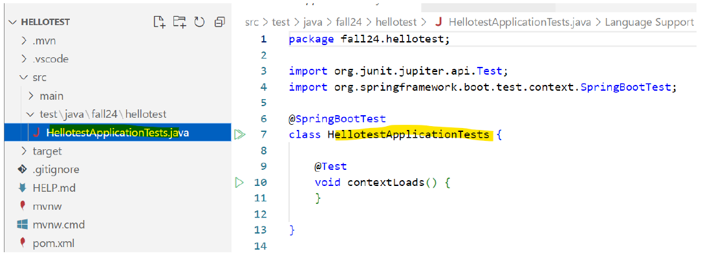

<!-- Slide number: 1 -->
# Server Programming: Testing
Juha Hinkula, Jukka Juslin, Tanja Bergius, Minna Pellikka

*Updated by Minna Pellikka 27.9.2024*

<!-- Slide number: 2 -->
# Spring Boot - Testing
- Spring Boot provides a number of utilities and annotations to help when testing your application

- When Spring boot project is created you can find from POM.XML test dependency
```java
<dependency>
	<groupId>org.springframework.boot</groupId>
	<artifactId>spring-boot-starter-test</artifactId>
	<scope>test</scope>
</dependency>
```
- This dependency provides some libraries and tools for testing, for instance Junit.

<!-- Slide number: 3 -->

- Spring Boot will create automatically one test class for you



<!-- Slide number: 4 -->

```java
package fall24.hellotest;

import org.junit.jupiter.api.Test;
import org.springframework.boot.test.context.SpringBootTest;

@SpringBootTest   //@SpringBootTest annotation tells that entire application will be started so that it can be tested
class HellotestApplicationTests {
//This is testing if application context is loaded without problems.
	@Test         //@Test annotation defines a method to be tested
	void contextLoads() {

  }
}
```

<!-- Slide number: 5 -->

- Spring Boot test dependency will add AssertJ library for assertions (http://joel-costigliola.github.io/assertj/index.html)

- Syntax
```java
assertThat(objectToTest). // code completion -> assertions specific to objectToTest 
```

- Examples
```java
assertThat(objectToTest).isNotNull();
```
```java
assertThat(”Hello World”).contains(”Hello”);
```
```java
assertThat(person.getName()).startsWith(”M”).endWith(”s”);
```

<!-- Slide number: 6 -->
# Smoke testing
- testing the major functions of software before carrying out formal testing
```java
  import static org.assertj.core.api.Assertions.assertThat;

  import org.junit.jupiter.api.Test;
  import org.springframework.beans.factory.annotation.Autowired;
  import org.springframework.boot.test.context.SpringBootTest;

  import fi.haagahelia.course.web.HelloController;

  @SpringBootTest
  public class HellotestApplicationTests {

  @Autowired
  private HelloController controller;

    @Test
    public void contexLoads() throws Exception {
      assertThat(controller).isNotNull();
    }
  }
```


<!-- Slide number: 7 -->
- Testing the web layer: Test will start the full Spring application context, but without the server by using Spring’s MockMvc.
```java
@SpringBootTest
@AutoConfigureMockMvc
public class WebLayerTest {
    @Autowired
    private MockMvc mockMvc;

    @Test
    public void testDefaultMessage() throws Exception {
        this.mockMvc.perform(get("/")).andDo(print()).andExpect(status().isOk())
                .andExpect(content().string(containsString("Hello World")));
    }
}
```

<!-- Slide number: 8 -->
# Testing the JPA repository / in-memory database
`@DataJpaTest` annotation will be used when testing in-memory database. It also turns on SQL logging
```java
@DataJpaTest
public class StudentRepositoryTest {
   @Autowired
   private StudentRepository repository;

   @Test
    public void findByLastnameShouldReturnStudent() {
        List<Student> students = repository.findByLastName("Johnson");
        assertThat(students).hasSize(1);
        assertThat(students.get(0).getFirstName()).isEqualTo("John");
    }

    @Test
    public void createNewStudent() {
       Department department = new Department("BITE");
       drepository.save(department);
       Student student = new Student("Mickey", "Mouse", "mm@mouse.com", department);

       Student student = new Student("Mickey", "Mouse", "mm@mouse.com", new Department("BITE"));
       repository.save(student);
       assertThat(student.getId()).isNotNull();
    }
}
```

<!-- Slide number: 9 -->
# JPA Testing on a real database (Postgres)
- When testing with other than development database annotations change and the way to reference category
```java
@SpringBootTest(classes = StudentListApplication.class)
@AutoConfigureTestDatabase(replace = AutoConfigureTestDatabase.Replace.NONE) //if you are using real db
public class StudentRepositoryTest {
    @Autowired
    private BookRepository repository;
    @Autowired
    private CategoryRepository crepository;

    @Test
    public void findByTitleShouldReturnAuthor() {
        List<Book> books = repository.findByTitle("The Old Man And The Sea");
        //assertThat(books).hasSize(1);
        assertThat(books.get(0).getAuthor()).isEqualTo("Ernest Hemingway");
    }

    @Test
    public void createNewBook() {

    Book book = new Book("Paul Trembley", "A Head Full of Ghosts", 2015, 16.30, "ISBN434345621394", crepository.findByName("Classics").get(0));
    repository.save(book);
    assertThat(book.getId()).isNotNull();
    }
}
```
